# CoreStack — Database Design Document

- **Status:** Draft, awaiting founder approval
- **Version:** 0.1
- **Date:** 2026-07-28
- **Depends on:** [Architecture](ARCHITECTURE.md) §11, §13, §20; [Vision](../product/VISION.md); ADR-0004
- **Scope:** the complete reference PostgreSQL design for all planned modules.
  Descriptive design only — DDL is produced per module during implementation,
  generated from this document's specifications.

**Reading conventions.** Every table is listed as
`schema.table` — purpose — columns (`name type` compact list) — keys/indexes/rules.
`PK` primary key, `UK` unique key, `FK` foreign key, `IX` index, `PUX` partial
unique index. All timestamps are `timestamptz`. Types are PostgreSQL types.

---

## 1. Global Design Decisions

These apply to every table; per-table listings only note deviations.

1. **One database, one Postgres schema per module** (`auth.*`, `tenancy.*`, …)
   plus `platform.*` for kernel-owned infrastructure. _Why:_ per-module ownership
   and blast radius with single-database operational simplicity (Architecture §11).
2. **Primary keys: application-generated UUIDv7** (`uuid` column type).
   _Why UUID:_ ids are generated in the application via the `IdGenerator` port
   (domain objects get identity before persistence; no round-trip; no sequence
   coupling between modules). _Why v7 (not v4):_ time-ordered UUIDs keep B-tree
   inserts append-mostly, avoiding the index fragmentation and cache-miss penalty
   that random v4 keys cause on large tables. The kernel's reference
   `UuidGenerator` will emit v7; the port contract doesn't change.
3. **No natural primary keys.** Emails, slugs, provider ids change; surrogate
   UUIDs never do. Natural keys are enforced as unique indexes instead.
4. **Foreign keys exist only _within_ a module's schema** (Architecture §6, §11).
   Cross-module references are plain `uuid` columns named `<concept>_id`,
   integrity maintained by events + reconciliation + purge handlers. _Why:_
   cross-schema FKs would fuse migration order and deletion order across modules —
   precisely the coupling module boundaries exist to prevent.
5. **Status/enum columns are `text` + `CHECK` constraint**, not native Postgres
   enums. _Why:_ adding a value to a native enum is easy, but removing/renaming is
   painful and lock-prone; `CHECK` constraints version cleanly with
   expand-and-contract migrations.
6. **`created_at` (default `now()`) and `updated_at` on every mutable table**;
   append-only tables carry `created_at`/`occurred_at` only and never have
   `updated_at`. `updated_at` is set by the application (not triggers) so the
   value is honest about application writes.
7. **Optimistic concurrency:** aggregate-root tables carry `version integer`
   (default 1), incremented on every write; a stale version surfaces as
   `ConflictError` (Architecture §3).
8. **Money is `bigint` minor units + `currency char(3)`** (ISO 4217). _Why:_
   floating point is forbidden for money; `numeric` invites unit ambiguity;
   integer cents matches every payment provider's API.
9. **Emails are stored lowercased** (normalized at the boundary) with plain
   unique indexes. _Why not `citext`:_ an extension dependency for what
   normalization at one boundary solves; fewer required extensions = easier
   managed-Postgres compatibility.
10. **Secrets doctrine (Architecture §42):**
    - _Verify-only secrets_ (session tokens, API keys, invitation/reset tokens):
      stored as `token_hash` (SHA-256 of a ≥256-bit random value). Never
      recoverable.
    - _Passwords:_ `argon2id` hash in `password_hash`.
    - _Use-again secrets_ (TOTP seeds, webhook signing secrets): stored encrypted
      (AES-256-GCM via an application `Encrypter` port with key-id for rotation)
      in `*_encrypted bytea` columns — encrypted because signing/verification
      needs the plaintext back, unlike login secrets.
11. **`jsonb` is for payloads and provider snapshots, never for queryable
    domain state.** Any field a query filters or joins on gets a real column.
    _Why:_ schemaless columns rot; indexes and constraints are the schema's
    documentation.
12. **Required extensions:** none for core (deliberate — maximum managed-Postgres
    compatibility). Optional: `pgvector` (only if the deferred AI module is
    adopted, §17), `pg_partman` (convenience for partition maintenance, with a
    CLI fallback).

## 2. Complete ERD

Conceptual ERD. Solid relationships are real FKs (within a schema); relationships
crossing schema boundaries (marked `..`) are **by-id references without FKs**
(rule 4). Append-only/partitioned tables are marked `※`.

```mermaid
erDiagram
    %% ══ auth schema ══
    user_accounts ||--o| password_credentials : "has"
    user_accounts ||--o{ sessions : "holds"
    user_accounts ||--o{ oauth_identities : "links"
    user_accounts ||--o| mfa_totp : "enrolls"
    user_accounts ||--o{ mfa_recovery_codes : "holds"
    user_accounts ||--o{ password_reset_tokens : "requests"
    user_accounts ||--o{ email_verification_tokens : "requests"

    %% ══ tenancy schema ══
    organizations ||--o{ memberships : "has"
    organizations ||--o{ invitations : "issues"
    user_accounts ||..o{ memberships : "member (by id)"
    organizations ||..o{ api_keys : "scopes (by id)"

    %% ══ rbac schema ══
    roles ||--o{ role_permissions : "grants"
    roles ||--o{ role_assignments : "assigned via"
    permission_catalog ||..o{ role_permissions : "keys"
    organizations ||..o{ roles : "defines custom (by id)"
    organizations ||..o{ role_assignments : "scopes (by id)"
    user_accounts ||..o{ role_assignments : "subject (by id)"

    %% ══ billing schema ══
    customers ||--o{ subscriptions : "pays for"
    subscriptions ||..|| plan_catalog : "on plan (by key)"
    organizations ||..o| customers : "billable as (by id)"
    organizations ||..o{ entitlements : "enjoys (by id)"
    provider_events ||..o{ subscriptions : "reconciles"

    %% ══ notifications schema ══
    organizations ||..o{ deliveries : "context (by id)"
    user_accounts ||..o{ preferences : "sets (by id)"
    user_accounts ||..o{ inbox_messages : "receives (by id)"

    %% ══ webhooks schema ══
    endpoints ||--o{ webhook_deliveries : "receives ※"
    organizations ||..o{ endpoints : "registers (by id)"

    %% ══ jobs schema ══
    schedules ||..o{ jobs : "enqueues"
    jobs ||--o{ job_history : "archived to ※"

    %% ══ storage schema ══
    organizations ||..o{ objects : "owns (by id)"

    %% ══ audit / platform ══
    organizations ||..o{ audit_events : "scoped ※"
    outbox ||..o{ audit_events : "feeds ※"
    outbox ||..o{ webhook_deliveries : "feeds ※"
```

Cardinality summary: a **user** exists platform-wide (auth) and joins many
**organizations** through memberships; every tenant-owned row in every other
schema hangs off an organization by `organization_id`; every state change flows
into `platform.outbox` and from there to audit, webhooks, and notifications.

## 3. `platform` Schema — Kernel Infrastructure

Owned by the kernel/composition root; the only schema every deployment has.

### platform.module_migrations

Tracks which migration version each module's schema is at — the CLI's
`corestack migrate` source of truth. One row per module.

- `module text PK`, `version integer`, `applied_at`, `checksum text`
- _Why per-module rows, not one global version:_ modules install and upgrade
  independently (any-subset composition, Architecture §8).

### platform.outbox ※ (partitioned monthly by `occurred_at`)

The transactional outbox (Architecture §13): every domain event, written in the
same transaction as the state change that produced it.

- `id uuid PK`, `event_name text`, `event_version smallint`, `occurred_at`,
  `organization_id uuid NULL` (platform-scoped events have none),
  `actor_type text CHECK (user|api_key|system)`, `actor_id uuid NULL`,
  `correlation_id uuid`, `causation_id uuid NULL`, `payload jsonb`
- IX `(occurred_at, id)` (relay scan order), IX `(organization_id, occurred_at)`
- Append-only: `UPDATE`/`DELETE` privileges revoked from the application role;
  old partitions dropped per retention policy after all checkpoints pass them.

### platform.outbox_checkpoints

Per-consumer delivery progress for at-least-once relay.

- `consumer text PK`, `last_occurred_at timestamptz`, `last_event_id uuid`,
  `updated_at`
- _Why (occurred_at, id) cursor not a sequence:_ survives partition drops and
  restores; pairs with the relay's scan index.

### platform.processed_events

Idempotency ledger for event consumers (dedupe helper, Architecture §13).

- `consumer text`, `event_id uuid`, `processed_at` — PK `(consumer, event_id)`
- Pruned in step with outbox retention.

### platform.idempotency_keys

Request-level idempotency for mutating REST endpoints (Architecture §26).

- `key text`, `scope text` (endpoint class), `request_hash text`,
  `response_snapshot jsonb`, `status text CHECK (in_progress|completed)`,
  `expires_at` — PK `(scope, key)`, IX `(expires_at)` for pruning
- `request_hash` detects key reuse with a _different_ body (rejected as conflict).

### platform.rate_limits

Reference adapter table for the `RateLimiter` port (fixed-window counters).

- `bucket text`, `window_start timestamptz`, `count integer` —
  PK `(bucket, window_start)`, pruned by window age
- _Why in Postgres:_ zero-infrastructure default, same promise as queues; Redis
  adapter replaces it wholesale when throughput demands.

## 4. Authentication Schema (`auth`)

### auth.user_accounts

The platform-wide person. Aggregate root; deliberately _not_ org-scoped — one
human, one account, many organizations (Architecture §6).

- `id uuid PK`, `email text`, `email_verified_at NULL`, `display_name text`,
  `status text CHECK (active|suspended|deleted)`, `suspended_reason text NULL`,
  `deleted_at NULL`, `version`, `created_at`, `updated_at`
- PUX `lower(email) WHERE deleted_at IS NULL` — _partial_ so a purged account's
  email can be re-registered, while live emails stay unique.

### auth.password_credentials

Password material, split from the account row.

- `user_id uuid PK/FK→user_accounts (CASCADE)`, `password_hash text` (argon2id),
  `updated_at`
- _Why a separate table:_ not every account has a password (OAuth-only users);
  splitting makes "has password?" a row-existence check, keeps the hot
  `user_accounts` row narrow, and lets DB privileges restrict which code paths
  can even read hashes.

### auth.sessions

Opaque server-side sessions (Architecture §16). The most-read table in the
platform — kept deliberately narrow.

- `id uuid PK`, `user_id uuid FK→user_accounts (CASCADE)`, `token_hash bytea`,
  `created_at`, `last_seen_at`, `expires_at` (sliding), `absolute_expires_at`,
  `ip inet NULL`, `user_agent text NULL`, `mfa_verified_at NULL` (step-up),
  `revoked_at NULL`, `revoked_reason text NULL`
- UK `token_hash` (the lookup key), IX `(user_id, revoked_at)` (device listing,
  mass revocation), IX `(expires_at)` (sweeper)
- Rows are soft-revoked (`revoked_at`) then swept — revocation must be auditable
  before rows disappear.

### auth.oauth_identities

Links between a user account and an external identity provider.

- `id uuid PK`, `user_id uuid FK (CASCADE)`, `provider text`,
  `provider_subject text`, `email_at_link text`, `created_at`
- UK `(provider, provider_subject)` — one external identity links to exactly one
  account; the account-takeover guard from Architecture §16 is enforced in the
  use case, this constraint is its backstop.

### auth.mfa_totp

TOTP enrollment; secret must be recoverable to verify codes → encrypted, not
hashed (rule 10).

- `user_id uuid PK/FK (CASCADE)`, `secret_encrypted bytea`, `key_id text`
  (rotation), `confirmed_at NULL`, `created_at`
- Unconfirmed enrollments (`confirmed_at IS NULL`) expire via sweeper — an
  enrollment is not MFA until the user proves possession.

### auth.mfa_recovery_codes

One-time backup codes; verify-only → hashed.

- `id uuid PK`, `user_id uuid FK (CASCADE)`, `code_hash bytea`, `used_at NULL`,
  `created_at` — IX `(user_id)`

### auth.password_reset_tokens / auth.email_verification_tokens

Same shape, separate tables (different lifecycles and abuse profiles).

- `id uuid PK`, `user_id uuid FK (CASCADE)`, `token_hash bytea UK`,
  `expires_at`, `used_at NULL`, `created_at` — IX `(user_id, created_at)`
  (per-user issuance throttling)
- Single-use enforced by `used_at` check inside the consuming transaction.

### auth.api_keys

Org-scoped programmatic credentials (Architecture §16).

- `id uuid PK`, `organization_id uuid` (by-id, no FK — cross-module),
  `name text`, `key_prefix text` (first 8 chars, for display/support),
  `token_hash bytea UK`, `scopes text[]` (rbac permission keys),
  `created_by uuid`, `last_used_at NULL` (updated at most once/minute to avoid
  write amplification), `expires_at NULL`, `revoked_at NULL`, `created_at`
- IX `(organization_id, revoked_at)`; purge handler deletes on org purge.

## 5. Tenancy Schema (`tenancy`)

### tenancy.organizations

The unit of tenancy, billing, and authorization scope (Architecture §19).
Aggregate root.

- `id uuid PK`, `name text`, `slug text`, `kind text CHECK (personal|team)`,
  `status text CHECK (active|suspended|pending_deletion|purged)`,
  `deleted_at NULL`, `purge_after NULL`, `version`, `created_at`, `updated_at`
- PUX `slug WHERE status <> 'purged'` — slugs become re-usable after purge.
- Two-phase deletion (§10): `pending_deletion` + `purge_after` drives the purge
  job that fans out `organization.purge_requested` to every module.

### tenancy.memberships

A user's belonging to an organization — the row almost every authorization
decision touches.

- `id uuid PK`, `organization_id uuid FK→organizations (CASCADE)`,
  `user_id uuid` (by-id → auth), `baseline_role text CHECK (owner|admin|member)`,
  `status text CHECK (active|suspended)`, `joined_at`, `created_at`, `updated_at`
- UK `(organization_id, user_id)`; IX `(user_id)` ("my organizations" lookup)
- `baseline_role` lives here (not rbac) so tenancy is self-sufficient when rbac
  isn't installed (Architecture §8); rbac _reads_ it as the floor and layers
  custom roles above.
- CHECK-adjacent invariant "an org has ≥1 owner" cannot be a table constraint —
  enforced in the use case under `SERIALIZABLE`-equivalent guard (version bump on
  the organization row makes the demote-last-owner race lose).

### tenancy.invitations

Email-addressed, single-use, expiring invitations (works pre-registration).

- `id uuid PK`, `organization_id uuid FK (CASCADE)`, `email text` (lowercased),
  `baseline_role text CHECK (admin|member)` (never owner — ownership transfers
  are a separate, audited use case), `token_hash bytea UK`, `invited_by uuid`,
  `expires_at`, `accepted_at NULL`, `accepted_by_user_id uuid NULL`,
  `revoked_at NULL`, `created_at`
- PUX `(organization_id, email) WHERE accepted_at IS NULL AND revoked_at IS NULL`
  — one _pending_ invitation per address per org; history rows remain.

## 6. Permissions Schema (`rbac`)

### rbac.permission_catalog

Mirror of code-registered permissions (Architecture §18). **Code is the source of
truth**; this table is synced at boot so the DB can validate grants and admin UIs
can enumerate — a read model of the code, never edited directly.

- `key text PK` (e.g. `billing:subscription.cancel`), `module text`,
  `description text`, `registered_at`, `retired_at NULL` (grants referencing
  retired permissions evaluate to deny and are flagged by `corestack doctor`)

### rbac.roles

System roles (shipped) and custom roles (org-defined, entitlement-gated).

- `id uuid PK`, `organization_id uuid NULL` (NULL = system role; by-id → tenancy),
  `key text`, `name text`, `description text`, `is_system boolean`,
  `version`, `created_at`, `updated_at`
- PUX `(key) WHERE organization_id IS NULL`;
  UK `(organization_id, key)` for custom roles
- System roles are seeded by migration and immutable through the API (enforced in
  use cases; `is_system` is the flag reviews check).

### rbac.role_permissions

The grant edges of a role.

- `role_id uuid FK→roles (CASCADE)`, `permission_key text FK→permission_catalog`,
  `created_at` — PK `(role_id, permission_key)`
- The FK to the catalog is _within-schema_ and therefore allowed — it prevents
  granting typo'd permissions at the cheapest possible layer.

### rbac.role_assignments

(user, role, org) — who is what, where.

- `id uuid PK`, `organization_id uuid` (by-id), `user_id uuid` (by-id),
  `role_id uuid FK→roles (RESTRICT)`, `granted_by uuid`, `created_at`
- UK `(organization_id, user_id, role_id)`;
  IX `(organization_id, user_id)` — the policy evaluator's exact lookup;
  IX `(role_id)` (impact analysis before role deletion; RESTRICT forces explicit
  unassignment — silently cascading away access grants hides security state
  changes, so deletion must be loud)
- Membership removal → `member.removed` event → assignment cleanup handler
  (eventual, idempotent), belt-and-braces because the evaluator _also_ requires
  an active membership: an orphaned assignment grants nothing.

### rbac.authz_versions

The cache-invalidation heartbeat (Architecture §12, §18).

- `organization_id uuid PK`, `version bigint`, `updated_at`
- Bumped in-transaction with any role/permission/assignment change in the org;
  cached policy snapshots are keyed by `(org, subject, version)` — invalidation
  by key-versioning, never enumeration.

## 7. Billing Schema (`billing`)

### billing.plan_catalog

Mirror of code-defined plans (Architecture §21): synced at boot; code is truth.

- `key text`, `plan_version integer`, `name text`, `entitlement_spec jsonb`
  (the entitlements this plan grants — spec, not state),
  `provider_refs jsonb` (e.g. Stripe price ids per interval),
  `active boolean`, `registered_at` — PK `(key, plan_version)`
- Versioned so existing subscriptions keep their contracted plan shape when the
  plan definition evolves (grandfathering is a data-model property, not a hack).

### billing.customers

The org ↔ payment-provider identity link.

- `organization_id uuid PK` (by-id → tenancy), `provider text` (e.g. `stripe`),
  `provider_customer_id text`, `billing_email text`, `created_at`, `updated_at`
- UK `(provider, provider_customer_id)` — webhook ingestion resolves the org
  through this exact index; a provider customer maps to exactly one org.

### billing.subscriptions

Authoritative local mirror of subscription state (state machine: `trialing →
active → past_due → canceled|unpaid`, plus `incomplete` pre-first-payment).

- `id uuid PK`, `organization_id uuid` (by-id), `plan_key text`,
  `plan_version integer`, `status text CHECK (…states above…)`,
  `current_period_start`, `current_period_end`, `cancel_at_period_end boolean`,
  `canceled_at NULL`, `trial_ends_at NULL`, `seats integer NULL`,
  `provider_subscription_id text UK`, `provider_state jsonb` (last reconciled
  snapshot, for support/debugging only — rule 11), `version`, `created_at`,
  `updated_at`
- PUX `(organization_id) WHERE status IN ('trialing','active','past_due')` — at
  most one live subscription per org (multi-product subscriptions are post-1.0;
  the constraint makes today's invariant explicit and searchable).

### billing.entitlements

The derived read model the whole app checks (`has('custom_roles')`, seat limits).
Rebuilt transactionally on every subscription state change from `plan_catalog`
spec; readable without joins, cache-friendly.

- `organization_id uuid`, `key text`, `value jsonb` (bool | number | string),
  `source text` (plan key/version or `override`), `updated_at` —
  PK `(organization_id, key)`
- Manual overrides (support gestures, custom deals) are rows with
  `source='override'` that reconciliation preserves — the schema encodes the
  operational reality that sales always needs exceptions.

### billing.entitlement_versions

Same pattern and rationale as `rbac.authz_versions`, for entitlement caches.

- `organization_id uuid PK`, `version bigint`, `updated_at`

### billing.provider_events ※ (partitioned monthly by `received_at`)

Webhook ingestion ledger: dedupe + audit of everything the provider told us.

- `id uuid PK`, `provider text`, `provider_event_id text`, `event_type text`,
  `received_at`, `processed_at NULL`,
  `status text CHECK (received|processed|skipped|failed)`, `failure_reason text`,
  `payload jsonb`
- UK `(provider, provider_event_id)` — the dedupe constraint that makes webhook
  redelivery harmless; per Architecture §21 payloads are hints — processing
  re-fetches truth from the provider API and reconciles.

## 8. Audit Schema (`audit`)

### audit.events ※ (partitioned monthly by `occurred_at`)

The append-only compliance trail (Architecture §6). Fed exclusively by the
outbox consumer — modules never write here directly, which is what makes the
trail complete-by-construction rather than complete-by-discipline.

- `id uuid PK`, `event_id uuid` (source outbox id — traceability),
  `occurred_at`, `organization_id uuid NULL`, `actor_type text`,
  `actor_id uuid NULL`, `actor_label text` (denormalized display name/key prefix
  at event time — the trail must remain readable after actors are purged),
  `action text` (event name), `resource_type text`, `resource_id uuid NULL`,
  `ip inet NULL`, `correlation_id uuid`, `metadata jsonb` (redacted per module
  redaction maps before insert), `search tsvector` (generated from action +
  labels; Postgres FTS per Architecture §23)
- IX `(organization_id, occurred_at DESC)` (the tenant timeline — primary query),
  IX `(organization_id, actor_id, occurred_at DESC)`,
  IX `(organization_id, resource_type, resource_id, occurred_at DESC)`,
  GIN `search`
- **Immutability enforced in the database:** the application role has
  INSERT/SELECT only — no UPDATE/DELETE grants on this schema. Retention =
  partition drops under a documented, org-notified policy (default 400 days;
  enterprise adopters extend).
- UK `(event_id)` per partition — idempotent consumption of outbox replays.

## 9. Notifications Schema (`notifications`)

### notifications.preferences

Per-user opt-outs by category and channel; enforced at dispatch (Architecture §15).

- `user_id uuid` (by-id), `organization_id uuid NULL` (NULL = global pref),
  `category text` (e.g. `billing`, `security`, `product`), `channel text CHECK
(email|in_app)`, `opted_out boolean`, `updated_at` —
  PK `(user_id, organization_id, category, channel)` with a sentinel-free
  partial-index treatment for the NULL org case (PUX on
  `(user_id, category, channel) WHERE organization_id IS NULL`)
- `security` category is not opt-out-able — enforced in the use case; the table
  stores the preference, policy decides its effect.

### notifications.deliveries ※ (partitioned monthly by `created_at`)

One row per attempted send on push channels (email now, others later) — the
operational log and the abuse/compliance evidence.

- `id uuid PK`, `organization_id uuid NULL`, `user_id uuid NULL`,
  `recipient_masked text` (e.g. `a***@example.com` — full address lives only in
  the job payload transiently; the durable log is privacy-minimized),
  `template_key text`, `channel text`, `status text CHECK
(queued|sent|failed|suppressed)`, `suppressed_reason text NULL` (opt-out,
  bounce), `attempts smallint`, `last_error text NULL`, `provider_message_id
text NULL`, `created_at`, `sent_at NULL`
- IX `(organization_id, created_at DESC)`, IX `(template_key, created_at DESC)`
  (template failure-rate metrics, Architecture §31)

### notifications.inbox_messages

The in-app channel's durable store.

- `id uuid PK`, `user_id uuid`, `organization_id uuid NULL`,
  `template_key text`, `payload jsonb` (typed per template), `created_at`,
  `read_at NULL`, `archived_at NULL`
- IX `(user_id, read_at, created_at DESC)` — the badge-count and inbox query;
  pruned by age after archive.

## 10. Jobs Schema (`jobs`)

### jobs.jobs

The hot queue table (Postgres reference adapter, `SKIP LOCKED` pattern,
Architecture §14). Kept small and write-hot; completed work moves out.

- `id uuid PK`, `queue text`, `name text`, `payload jsonb`,
  `status text CHECK (pending|running|completed|failed|dead)`,
  `priority smallint`, `run_at`, `attempts smallint`, `max_attempts smallint`,
  `backoff_spec jsonb` (strategy + base delay), `locked_at NULL`,
  `locked_by text NULL` (worker id — visibility timeout = `locked_at` age),
  `last_error text NULL`, `correlation_id uuid`, `organization_id uuid NULL`,
  `created_at`, `finished_at NULL`
- IX `(queue, status, run_at, priority)` — the single fetch-next index the
  worker query uses (`WHERE status='pending' AND run_at <= now() … FOR UPDATE
SKIP LOCKED`); IX `(status, locked_at)` (stalled-job reaper)
- Enqueue happens in the caller's transaction (transactional enqueue — a job
  enqueued by a use case commits or rolls back with it, Architecture §14).

### jobs.job_history ※ (partitioned monthly by `finished_at`)

Terminal jobs (completed/dead) moved here by the sweeper — keeps the hot table's
indexes tiny while preserving forensics.

- Same columns as `jobs.jobs` minus locking fields; IX `(name, finished_at
DESC)`, IX `(status, finished_at DESC)` (dead-letter review)

### jobs.schedules

Cron/interval definitions (code-registered, synced at boot — same
code-is-truth pattern as catalogs).

- `id uuid PK`, `name text UK`, `cron text`, `timezone text`, `job_name text`,
  `payload jsonb`, `enabled boolean`, `last_enqueued_at NULL`,
  `next_run_at`, `created_at`, `updated_at`
- IX `(enabled, next_run_at)`; the scheduler claims due rows with the same
  `SKIP LOCKED` discipline so multiple workers never double-fire.

## 11. Webhooks Schema (`webhooks`)

### webhooks.endpoints

Adopter/org-registered outbound webhook destinations (Architecture §6).

- `id uuid PK`, `organization_id uuid` (by-id), `url text` (https enforced by
  CHECK on scheme + SSRF policy in the use case: no private-range hosts),
  `description text`, `subscribed_events text[]`,
  `secret_encrypted bytea`, `key_id text` (signing needs plaintext back —
  encrypted per rule 10; rotation = new secret, dual-sign window),
  `status text CHECK (active|paused|disabled_by_failure)`,
  `consecutive_failures integer`, `created_by uuid`, `version`, `created_at`,
  `updated_at`
- IX `(organization_id, status)`; auto-disable after N consecutive failures
  emits a notification (the schema carries the counter, policy lives in code).

### webhooks.deliveries ※ (partitioned monthly by `created_at`)

Per-attempt delivery log — the debugging surface adopters actually see.

- `id uuid PK`, `endpoint_id uuid FK→endpoints (CASCADE)`, `event_id uuid`
  (outbox id), `event_name text`, `attempt smallint`,
  `status text CHECK (pending|delivered|failed)`, `request_headers jsonb`
  (signature, timestamp — for support reproduction), `response_status smallint
NULL`, `response_snippet text NULL` (first 1 KB), `duration_ms integer NULL`,
  `next_retry_at NULL`, `created_at`
- IX `(endpoint_id, created_at DESC)`; UK `(endpoint_id, event_id, attempt)` —
  idempotent redelivery bookkeeping.

## 12. File Storage Schema (`storage`)

### storage.objects

Metadata registry over the `FileStorage` port (Architecture §22) — the port
moves bytes; this table owns identity, ownership, and lifecycle.

- `id uuid PK`, `organization_id uuid NULL` (by-id; NULL = platform-owned),
  `bucket text`, `object_key text` (provider key, derived from id — never
  user-controlled, which kills path-traversal by construction),
  `filename text` (original, display only), `content_type text` (allowlisted),
  `size_bytes bigint`, `checksum_sha256 bytea`, `uploaded_by uuid NULL`,
  `status text CHECK (pending|available|deleted)` (pending = signed-URL upload
  initiated, confirmed on completion callback — orphan sweeper reaps stale
  pendings), `created_at`, `deleted_at NULL`
- UK `(bucket, object_key)`; IX `(organization_id, created_at DESC)`
- Soft delete (`deleted_at`) precedes provider-side deletion by a grace window;
  the purge job hard-deletes bytes then the row — metadata must outlive bytes,
  never the reverse.

## 13. Plugin Schema

**Decision: there are no generic plugin tables — by design** (Architecture §24:
modules _are_ the plugin system; no dynamic runtime loading).

What exists instead:

1. **Third-party modules own a Postgres schema of their own**, exactly like
   first-party modules (`<vendor>_<module>.*` naming to prevent collisions), with
   their migrations registered in `platform.module_migrations` (§3) through the
   standard module lifecycle contract. The "plugin schema" is therefore a
   _convention with teeth_ — same rules: no FKs into other schemas, org-id
   scoping, RLS participation, purge handler for org deletion.
2. **`platform.module_migrations` is the only registry** — a row per installed
   module (first- or third-party). Discovery/marketplace metadata (Vision §15)
   is an npm/docs concern, not a database concern.

_Why no plugin_registry / plugin_settings tables:_ they exist to support runtime
installation and dynamic configuration — both explicitly rejected. Plugin
configuration is composition-root code, validated by the plugin's own Zod schema
at boot (Architecture §8). A table would be a second, driftable source of truth.

## 14. AI Schema (`ai`) — Reserved, Deferred

**Honest status:** no AI module exists in the approved vision or architecture
scope. Rather than silently violate scope, this section _reserves_ the design so
a future `@corestack/ai` module (post-1.0 candidate, requires its own
vision-amendment ADR) has a database plan consistent with every rule above —
and so no other module squats on the `ai` schema name.

Reserved design, following all global rules (org-scoped, no cross-schema FKs,
partitioned where append-only):

### ai.usage_events ※ (partitioned monthly by `occurred_at`)

Metering — the one table every AI feature needs on day one, because AI features
have marginal cost and billing (§7) needs usage facts.

- `id uuid PK`, `organization_id uuid`, `user_id uuid NULL`, `feature text`,
  `provider text`, `model text`, `tokens_in integer`, `tokens_out integer`,
  `cost_minor bigint NULL`, `currency char(3) NULL`, `correlation_id uuid`,
  `occurred_at`
- IX `(organization_id, occurred_at DESC)`; feeds entitlement limits (e.g.
  monthly token quotas) via periodic rollup.

### ai.conversations / ai.messages

Durable chat state for assistant-style features.

- `conversations`: `id uuid PK`, `organization_id uuid`, `user_id uuid`,
  `title text`, `status text CHECK (active|archived)`, `created_at`,
  `updated_at` — IX `(organization_id, user_id, updated_at DESC)`
- `messages`: `id uuid PK`, `conversation_id uuid FK (CASCADE)`,
  `role text CHECK (user|assistant|tool)`, `content jsonb`,
  `tokens integer NULL`, `created_at` — IX `(conversation_id, created_at)`

### ai.embeddings (requires `pgvector` — the one extension gate, §1 rule 12)

- `id uuid PK`, `organization_id uuid`, `source_type text`, `source_id uuid`,
  `chunk_index integer`, `content text`, `embedding vector(1536)`,
  `embedded_with text` (model — re-embed migrations need it), `created_at`
- UK `(source_type, source_id, chunk_index)`; HNSW index on `embedding`
  (build-cost paid at write, query-latency won at read — right trade for
  read-heavy RAG); **all similarity queries filter `organization_id` before
  vector search** — tenant isolation applies to semantic search identically.

## 15. Tenant Isolation (cross-cutting)

The database's contribution to the four-layer model (Architecture §20):

- **Column standard:** every tenant-owned table carries `organization_id uuid
NOT NULL` (nullable only where platform-scoped rows are legitimate, listed
  per-table above). It is always a leading column of the table's primary access
  index.
- **Row-Level Security as backstop:** RLS enabled on every tenant-owned table;
  policy: `organization_id = current_setting('app.current_org')::uuid`, with a
  separate policy role for platform-scoped access (relay, sweepers, support
  tooling) that is _not_ the web application's role. The reference Postgres
  adapter sets `app.current_org` per transaction from the request `Context`.
  RLS is the seatbelt; port signatures are the steering (Architecture §20).
- **No cross-tenant uniqueness:** unique constraints on tenant data always
  include `organization_id` (e.g. role keys, §6) — a tenant's namespace choices
  must never be constrained by another tenant's.
- **Purge protocol:** org deletion fans out `organization.purge_requested`;
  every schema owns a purge handler deleting its org's rows (jobs, storage
  bytes, etc.); audit partitions are the deliberate exception (compliance trail
  survives, actor rows already denormalized per §8).
- **Isolation test suite** (Architecture §44) runs against RLS-enabled databases
  in CI — the backstop itself is tested, not assumed.

## 16. Relationships, Keys & Constraints — Consolidated Policy

- **Primary keys:** UUIDv7, app-generated (rule 2); composite natural PKs only
  on pure association/ledger tables (`role_permissions`, `processed_events`,
  `entitlements`, `preferences`, `rate_limits`) where the pair _is_ the identity
  and no external reference to the row exists.
- **Foreign keys (within schema only):** `ON DELETE CASCADE` for
  owned-composition edges (sessions→user, deliveries→endpoint);
  `ON DELETE RESTRICT` where deletion must be an explicit, audited decision
  (assignments→role). `SET NULL` is unused — nullable ownership hides bugs.
- **Unique keys:** natural uniqueness is _always_ an index, frequently partial
  (PUX) to scope uniqueness to live rows (emails, slugs, pending invitations,
  live subscriptions). This is the standard pattern that makes soft deletion and
  uniqueness coexist without tombstone collisions.
- **CHECK constraints:** every `status` column (rule 5); scheme/shape guards
  where cheap (webhook URL scheme, non-negative money/seats). Invariants
  spanning rows (≥1 owner) live in use cases with optimistic-lock protection —
  documented per table above so no reader mistakes their absence for oversight.
- **NOT NULL is the default**; nullable columns are individually justified in
  the listings (a NULL must _mean_ something, e.g. "system-scoped", "not yet").

## 17. Soft Deletes — Consolidated Policy

Soft deletion is **not** a blanket pattern; it is applied per lifecycle need:

| Pattern                            | Tables                                                                                   | Why                                                                                                                                                |
| ---------------------------------- | ---------------------------------------------------------------------------------------- | -------------------------------------------------------------------------------------------------------------------------------------------------- |
| Two-phase soft→purge               | `organizations`, `user_accounts`, `storage.objects`                                      | undo window + GDPR-compliant hard erasure (Architecture §20)                                                                                       |
| Soft-revoke, then sweep            | `sessions`, `api_keys`, tokens                                                           | revocation must be observable/auditable before rows vanish                                                                                         |
| History rows (state, not deletion) | `invitations`, `subscriptions`                                                           | terminal states _are_ the record; deleting history destroys evidence                                                                               |
| Hard delete                        | `memberships` (removal), `role_assignments`, `preferences`                               | the _audit trail_ records the change; keeping authorization tombstones invites accidental resurrection — the worst failure mode for access control |
| Append-only, partition-pruned      | `audit.events`, `outbox`, `deliveries`, `job_history`, `provider_events`, `usage_events` | immutability + retention by partition drop                                                                                                         |

_Why not global `deleted_at` everywhere:_ universal soft delete poisons every
query with a filter that one forgotten `WHERE` turns into a data leak, bloats
unique-constraint design, and pretends to be an audit trail while being a worse
one. CoreStack has a real audit trail (§8); tables keep only the lifecycle
states their domain actually has.

## 18. Migration Strategy

- **Per-module, ordered, plain-SQL migrations shipped inside each package**
  (Architecture §11), applied by `corestack migrate`, tracked in
  `platform.module_migrations` with checksums (drift detection — a hand-edited
  production schema fails loudly, not subtly).
- **Expand-and-contract is mandatory** for anything a running version reads:
  add-nullable → backfill (batched, throttled) → enforce (NOT NULL/constraint) →
  contract (drop old) across ≥2 releases, honoring the N/N+1 zero-downtime
  contract (Architecture §36).
- **Rules of conduct:** forward-only in production (down migrations are dev
  conveniences); no data rewrites inside DDL migrations (backfills are separate,
  resumable steps); every migration states its lock impact in a header comment;
  `CREATE INDEX CONCURRENTLY` (and its non-transactional handling) is the
  default for indexes on live tables; partitioned tables create next-period
  partitions ahead of time via scheduled job (§10) with `pg_partman` as optional
  convenience.
- **Cross-module sequencing:** none required — by construction (no cross-schema
  FKs), modules migrate in any order; the CLI applies kernel/`platform` first
  only because the outbox must exist before modules emit.

## 19. Backup Strategy

Reference guidance shipped as a runbook (Architecture §41); the design's job is
to make the guidance simple, and it is simple because **Postgres is the single
source of truth** for all durable state:

- **Continuous archiving + PITR** (WAL archiving; RPO ≤ 5 min target on managed
  Postgres defaults) plus daily base backups; retention ≥ 30 days.
- **Restores are drilled, not assumed:** quarterly documented restore test into
  a scratch environment; `corestack doctor --verify-restore` checks schema
  versions and outbox/checkpoint coherence after a restore.
- **Post-restore consistency is designed-in:** outbox checkpoints and idempotent
  consumers make event/webhook/notification replay deterministic; billing state
  re-reconciles from the provider (webhook hints + API truth, §7) — external
  side effects are replayable or reconcilable by construction.
- **What is _not_ in the database** (and must be backed up separately by the
  adopter): object-storage bytes (provider-side versioning/replication
  guidance), encryption keys (KMS — losing the key class is losing `*_encrypted`
  columns; documented loudly).
- Logical dumps (`pg_dump`) are for migration/inspection, not DR — stated
  explicitly because teams routinely confuse the two.

## 20. Scaling Strategy

Mirrors the honest ladder (Architecture §41), with the database-specific rungs:

1. **Design headroom first:** narrow hot tables (`sessions`, `jobs`), UUIDv7
   append-friendly indexes, partitioned append-only tables _from day one_
   (retrofitting partitioning is the expensive surgery — so audit/outbox/
   deliveries/history are born partitioned), covering indexes matched to the
   exact hot queries listed per table.
2. **Connection pooling** (PgBouncer/managed equivalent, transaction mode) —
   documented as the first real bottleneck in Node deployments; the reference
   adapter keeps transactions short and never holds a connection across await
   points outside a transaction.
3. **Read scaling:** read replicas for read models (audit queries, dashboards,
   inbox) — the port layer marks read-only use cases, so routing is an adapter
   concern; replication lag is acceptable there and _only_ there (authorization
   and entitlement reads stay on primary — stale security state is not a
   trade-off we sell).
4. **Write scaling:** partition maintenance + retention keep working sets
   bounded; the queue's hot-table sweep (§10) keeps `SKIP LOCKED` scans O(small);
   outbox relay batches by `(occurred_at, id)` cursor.
5. **The exits, in order:** move queue/cache to Redis adapters; move a hot
   module (usually audit or jobs) to its _own database_ — possible precisely
   because schemas have no cross-FKs and communicate via outbox; then module
   extraction to a service (Architecture §41 rung 4). Sharding by tenant is the
   documented last resort, and the pooled model's org-id-everywhere discipline
   is exactly what makes citus-style or app-level sharding feasible _if_ an
   adopter ever reaches it.

---

**Stopping here, per instruction.** Upon approval: this document's decisions are
codified into the module ADR set (0007+ batch, per Architecture §48), and the
identity-core requirements phase proceeds with `tenancy` and `auth` schemas as
specified in §4–§5.
