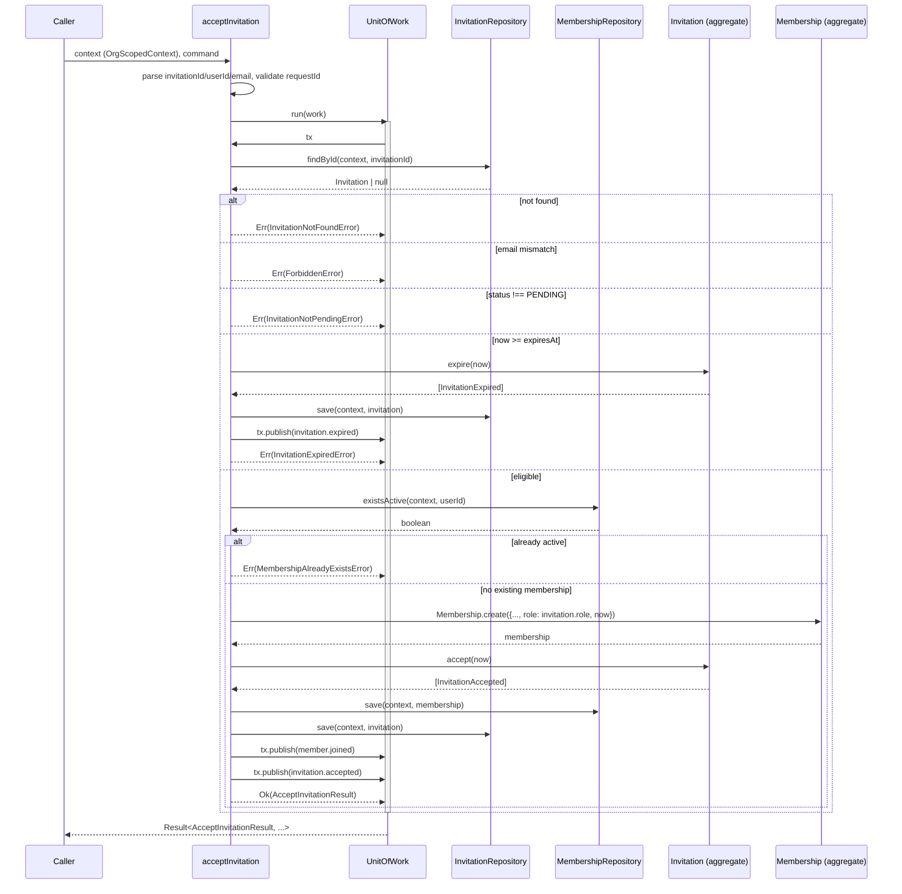

# `acceptInvitation` Use Case

- **Task:** E05-T07 — the membership-admission workflow. "This task closes
  the currently documented authorization gap and defines how an accepted
  invitation becomes an active membership" (founder directive, Section 1).
- **Status:** application layer only. No repository adapters, no SQL, no
  RLS, no migrations, no HTTP handlers, no email delivery, no invitation
  tokens — all explicitly out of scope.
- **Location:** `packages/tenancy/src/application/accept-invitation.ts`.

## Command flow

```ts
const result = await acceptInvitation(context, command, {
  uow, invitationRepository, membershipRepository, ids, clock,
});
```

1. Parse `command.invitationId` via `InvitationId.from`.
2. Parse `command.userId` via `UserId.from`.
3. Parse `command.email` via `Email.from` — the accepting user's *claimed*
   identity (Section 3).
4. Validate `requestId` is non-empty after trimming.
5. Look up the invitation via `invitationRepository.findById`. Not found →
   `InvitationNotFoundError`.
6. **Identity check**: reject if `invitation.email` doesn't equal the
   claimed `email` — `ForbiddenError`. See "Trust assumptions" below.
7. Reject if `invitation.status !== PENDING` — `InvitationNotPendingError`
   (covers already-`ACCEPTED`, already-`REVOKED`, and already-`EXPIRED` in
   storage).
8. **Expiry enforcement** (Section 7): if `now >= invitation.expiresAt`,
   call `invitation.expire(now)`, persist it, publish
   `invitation.expired`, and return `InvitationExpiredError` — the
   invitation's stored state changes even on this failing path.
9. Check `membershipRepository.existsActive` for this user in this
   organization. Already active → `MembershipAlreadyExistsError`.
10. Construct the `Membership` aggregate at the invitation's role via
    `Membership.create`.
11. Call `invitation.accept(now)`.
12. Persist both via `membershipRepository.save`/`invitationRepository.save`.
13. Pull both aggregates' domain events, map each to a kernel
    `DomainEvent`, and stage them via `tx.publish(...)`.
14. Return `Ok(AcceptInvitationResult)` — a DTO, never either aggregate
    (Section 6).

Steps 5–14 all run inside one `deps.uow.run(async (tx) => { ... })` call
(Section 5: "Persist both changes inside one UnitOfWork") — including the
expiry-enforcement branch, which persists and publishes before returning
`Err`. Steps 1–4 (parsing/validation) run before entering the
`UnitOfWork`, matching `createOrganization`/`inviteMember`'s own
structure.

## Sequence diagram



## Authorization matrix

Two separate authorization rules exist across the two use cases this
task touches — Section 3's "minimum authorization rule":

| Operation | Rule | Enforced by |
| --- | --- | --- |
| Invitation creation (`inviteMember`) | Inviter must have `ACTIVE` `OWNER` or `ADMIN` membership; `ADMIN` may not invite `ADMIN`; nobody may invite `OWNER` | `canInviteAs` (`invite-authorization.ts`), called from `inviteMember` (Section 8) |
| Invitation acceptance (`acceptInvitation`) | The accepting user's claimed email must equal the invitation's own email | This use case's identity check (step 6 above) |

`canInviteAs`'s full matrix (`inviterRole` × `targetRole`):

| Inviter role | Can invite `MEMBER` | Can invite `ADMIN` | Can invite `OWNER` |
| --- | --- | --- | --- |
| `OWNER` | ✅ | ✅ | ❌ (nobody can) |
| `ADMIN` | ✅ | ❌ | ❌ |
| `MEMBER` | ❌ | ❌ | ❌ |

`targetRole === OWNER` is rejected unconditionally, before the
`inviterRole` switch even runs — matching Section 8's "nobody can invite
OWNER" and mirroring `CannotInviteOwnerError`'s own earlier, defense-in-
depth rejection in `inviteMember` (a caller going through the use case
never actually reaches `canInviteAs` with `targetRole === OWNER`, since
`CannotInviteOwnerError` fires first).

`inviteMember`'s own authorization check additionally requires the
inviter's membership to be `ACTIVE` (not just present) — Section 3 says
only "must have OWNER or ADMIN membership," without specifying status.
This is a judgment call, not something the founder directive dictates
explicitly: a `SUSPENDED` owner is intentionally denied invite
permission, on the reasoning that a suspended membership shouldn't grant
active privileges. Documented here so it's visible as a deliberate
choice rather than an accidental side effect of the status enum's
existence.

## Expiry enforcement

Section 7: "This use case is responsible for enforcing time." E05-T05's
`Invitation.expire()` deliberately never compares `now` against
`expiresAt` itself (documented explicitly in that aggregate's own
non-goals) — this use case is the first caller that performs that
comparison and acts on it.

Critically, discovering an expiry is **not a no-op rejection**: when
`now >= invitation.expiresAt` is true for a still-`PENDING`-in-storage
invitation, this use case:

1. calls `invitation.expire(now)` (transitions `PENDING` → `EXPIRED`,
   records `InvitationExpired`),
2. persists that change via `invitationRepository.save`,
3. publishes `invitation.expired` through the same `UnitOfWork`,
4. *then* returns `Err(InvitationExpiredError)`.

The invitation's stored state must reflect what actually happened — a
caller who retries the same acceptance later must see `EXPIRED`, not
`PENDING` (which would let a second acceptance attempt slip through the
status check only to be caught by expiry again, an unnecessary
round-trip, or worse, race with a differently-timed clock).

This is the concrete enforcement point that closes the gap E05-T05's own
domain doc flagged: "a `PENDING` invitation past its `expiresAt` is still
structurally acceptable [to the aggregate]; a future `AcceptInvitation`
use case is responsible for the `now > expiresAt` check itself." This is
that future use case.

## Membership creation

`Membership.create` is called with `role: invitation.role` directly —
`InvitationRole`'s type (`"ADMIN" | "MEMBER"`) is a narrower string union
than `MembershipRole`'s (`"OWNER" | "ADMIN" | "MEMBER"`), so no cast is
needed; the assignment is structurally sound at the type level and
correct at the value level (an invitation can never carry `"OWNER"` —
`Invitation.create`'s own `assertValidInvitationRole` rejects it, and
`inviteMember`'s `CannotInviteOwnerError` rejects it even earlier).

The resulting membership is always `ACTIVE` (`Membership.create`'s only
constructor path) — there is no route from invitation acceptance to a
`SUSPENDED` starting state.

**Authorization is evaluated at invitation creation, not re-evaluated at
acceptance.** If an invitation was issued for `ADMIN` by an inviter who
was authorized at the time, and organizational policy or the inviter's
own role changes before the invitee accepts, this use case does not
re-check whether *that* invitation would still be authorized to create
under today's `canInviteAs` matrix — it simply honors the invitation as
issued. This is a deliberate, not-yet-solved consequence of splitting
authorization (invite time) from admission (accept time) across two use
cases; revoking a still-pending invitation if policy changes is
`Invitation.revoke()`'s job, not this one's.

## Event flow

Two possible outcomes publish events, never both:

- **Success**: `Membership.create()`'s `MembershipCreated` maps to
  `MEMBER_JOINED_EVENT`/`MemberJoinedPayload` (E05-T01's wire contract,
  first ever actually published by this task — see "MemberJoinedPayload
  casing fix" below), and `invitation.accept()`'s `InvitationAccepted`
  maps to the new `INVITATION_ACCEPTED_EVENT`/`InvitationAcceptedPayload`
  (added this task).
- **Expiry discovered**: `invitation.expire()`'s `InvitationExpired` maps
  to the new `INVITATION_EXPIRED_EVENT`/`InvitationExpiredPayload` (added
  this task). No `Membership` event, since no membership was created.
- **Every other failure path** (not found, email mismatch, not pending,
  membership already exists): no event published, no aggregate mutated.

### `MemberJoinedPayload` casing fix

`MemberJoinedPayload.role` was declared `"owner" | "admin" | "member"`
(lowercase) in E05-T01, before the real, uppercase `MembershipRole` enum
existed (E05-T04). Nothing ever published this event until this task —
`acceptInvitation` is the first use case that calls
`membershipRepository.save` and publishes `MEMBER_JOINED_EVENT`. Fixing
the casing to `"OWNER" | "ADMIN" | "MEMBER"` therefore changes no shipped
behavior (nothing ever emitted the lowercase shape), and follows the
exact precedent `InvitationCreatedPayload.role` set in E05-T06 when *it*
became the first real consumer of its own event: author the payload
against the real aggregate, don't perpetuate a stale placeholder.

## Trust assumptions

Section 3/13 are explicit: "do not introduce authentication
infrastructure; treat identity as an input," and "keep identity as an
application input." This use case takes both `command.userId` and
`command.email` as already-resolved, application-supplied claims. It does
**not**:

- verify that `command.email` genuinely belongs to `command.userId` (no
  `User`/session/auth module exists anywhere in this codebase to check
  this against);
- authenticate the caller in any way;
- resolve identity from a token, cookie, or header.

What it **does** do: check that the two claims are *internally
consistent with the invitation being accepted* — `command.email` must
equal `invitation.email`. This is a narrower guarantee than "the
accepting user really is who they claim," and is documented as such
rather than silently assumed to be authentication. The application layer
(a future HTTP handler, E05-T24–T25) is responsible for ensuring
`command.email` reflects the authenticated caller's real, verified email
before this use case is ever invoked — this use case trusts that
contract, it does not enforce it.

**No dedicated error type for the identity mismatch.** Section 2 lists
five new error types for this task; none of them names the
acceptor-identity check specifically. A bare kernel `ForbiddenError` is
returned instead of introducing a sixth type beyond Section 2's explicit
list — a deliberate scope decision, not an oversight, made and documented
here rather than silently choosing one of the five existing error names
for an unrelated failure mode.

**Unlike `inviteMember`, this command carries no `organizationId` field.**
`inviteMember` (E05-T06) requires one on its command because Section 3 of
that task's directive explicitly listed it, and it's checked against
`context.organizationId` for a `ForbiddenError` on mismatch. This task's
directive lists no equivalent field for `AcceptInvitationCommand`, and
none is added: `context: OrgScopedContext` already scopes every
repository call this use case makes, and an org-scoped repository
returning a row *is* the tenant-isolation guarantee — the same structural
property the RLS harness (E03-T30) certifies. There is no second,
client-supplied `organizationId` here for a mismatch to even be possible
against.

## Non-goals

- **Repository adapters, SQL, RLS, migrations, HTTP handlers, email
  delivery, invitation tokens** — explicitly out of scope per the founder
  directive's opening line and Section 13.
- **`User`/`Session`/`Auth`/`Token` modules** — explicitly prohibited
  (Section 13). Identity stays an application input.
- **Invitation-token verification** — no token field exists on
  `Invitation` at all (E05-T05); nothing to verify.
- **Re-authorizing an invitation at acceptance time** — see "Membership
  creation" above; authorization is a creation-time concern only.
- **Ownership transfer** — `canInviteAs` structurally denies inviting
  `OWNER`; nothing in either use case moves ownership from one membership
  to another (Section 8: "do not implement ownership transfer").
- **A hard duplicate-membership guarantee.** `existsActive` is a
  best-effort, friendly-error check — same shape
  `create-organization-usecase.md`/`invite-member-usecase.md` document for
  `existsBySlug`/`existsPendingForEmail`: nothing durable yet prevents two
  concurrent `acceptInvitation` calls for the same user from both passing
  it before either `save`s, pending a real uniqueness constraint
  (E05-T21).
- **`requestId` propagation** — validated for presence only, same
  non-goal `createOrganization`/`inviteMember` document for their own
  `requestId`.
- **Wiring into `createTenancyModule`'s `useCases`** — `TenancyUseCases`
  remains `Record<string, never>` until a future task wires commands into
  the module factory.
- **The 3-state vs. 4-state organization-model reconciliation** — not
  touched by this task; this use case never reads `Organization` at all.
- **Automatic/scheduled expiry sweeps.** `invitation.expire()` is only
  ever called here, lazily, when an acceptance attempt discovers the
  expiry — no background job walks pending invitations looking for
  expired ones. That remains a future task's job (same open item
  `invitation-domain.md` documents).
