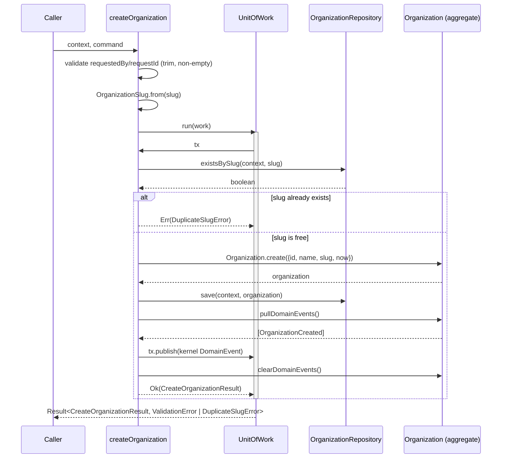

# `createOrganization` Use Case

- **Task:** E05-T03 — the first real application service in CoreStack.
  "Validates that the Tenancy domain model, repository ports,
  `UnitOfWork` contracts, and event flow work together without
  introducing infrastructure coupling" (founder directive, Section 1).
- **Status:** application layer only. No repository adapters, no SQL, no
  RLS, no migrations, no HTTP handlers — all explicitly out of scope.
- **Location:** `packages/tenancy/src/application/create-organization.ts`.

## Command flow

```ts
const result = await createOrganization(context, command, {
  uow, repository, ids, clock,
});
```

1. Validate `requestedBy`/`requestId` are non-empty after trimming.
2. Validate the slug format by delegating to `OrganizationSlug.from` —
   not re-implemented here (Section 3: "do not duplicate domain
   validation unnecessarily").
3. Check slug uniqueness via `repository.existsBySlug`.
4. If it exists: return `Err(DuplicateSlugError)`. Nothing else happens.
5. Otherwise: construct the `Organization` aggregate via
   `Organization.create` (name-length and further slug validation happen
   here, inside the aggregate — not duplicated at the command layer
   either).
6. Persist via `repository.save`.
7. Pull the aggregate's domain events, map each to a kernel `DomainEvent`,
   and stage it via `tx.publish(...)`.
8. Return `Ok(CreateOrganizationResult)` — a DTO, never the aggregate
   (Section 6).

Steps 3–8 all run inside one `deps.uow.run(async (tx) => { ... })` call
(Section 4: "All inside a single UnitOfWork").

## Sequence diagram



## Validation layers

Three layers, each owning a distinct concern — no layer re-validates what
another already owns:

| Layer | Owns | Example |
| --- | --- | --- |
| Command (this use case) | Fields with no domain concept of their own | `requestedBy`/`requestId` non-empty after trim |
| Value object (`OrganizationSlug`, E05-T02) | Slug format | 3–50 chars, lowercase, hyphen rules |
| Aggregate (`Organization.create`, E05-T02) | Everything about constructing a valid organization | Name length, `OrganizationId` UUID format, `OrganizationSlug` re-validated as part of construction |

The slug is validated twice in the *call sequence* (once via `OrganizationSlug.from`
before the uniqueness check, once again inside `Organization.create`), but
by the **same function** both times — there is exactly one implementation
of the slug rules, invoked twice on an already-valid string. This is a
deliberate, cheap redundancy, not duplicated logic: the uniqueness check
needs a validated `OrganizationSlug` to query by, and `Organization.create`'s
own signature (built in E05-T02, out of scope to change here) still takes
a raw string and validates it itself.

## Duplicate handling

`DuplicateSlugError` (extends kernel's `ConflictError`) is returned when
`existsBySlug` reports a match. On this path: no aggregate is constructed,
nothing is persisted, no event is published.

**This is not yet a hard uniqueness guarantee.** The whole flow runs
inside one `UnitOfWork.run()` call, but nothing durable enforces
uniqueness until a real adapter exists:

- The in-memory reference `UnitOfWork` provides no isolation at all.
- Even a real Postgres transaction at the default isolation level does
  not, by itself, prevent two concurrent requests from both passing
  `existsBySlug` before either `save`s — that requires a **unique
  constraint on the slug column**, which doesn't exist yet (no migration
  until E05-T21).

Until E05-T21 adds that constraint, `existsBySlug` is a best-effort,
friendly-error check that catches the common case (a slug that's already
taken) and gives a clean `DuplicateSlugError` instead of a raw constraint
violation — not a correctness guarantee against a genuine race. This is
recorded here as a known gap for E05-T21, not silently assumed solved.

## Event flow

`Organization.create()` only ever produces one domain event,
`OrganizationCreated` (E05-T02). This use case maps it to the kernel
`DomainEvent` envelope:

```ts
createEvent<OrganizationCreatedPayload>(
  {
    name: ORGANIZATION_CREATED_EVENT, // "organization.created"
    version: 1,
    organizationId: event.organizationId, // explicit override — see below
    payload: { organizationId, name, slug },
  },
  context,
  { clock, ids },
)
```

Two things worth calling out:

- **`organizationId` is explicitly overridden**, not left to default to
  `context.organizationId` (which is `null` here — creating an
  organization is necessarily a pre-org-scope operation). The published
  event's tenant-scope field is the *newly created* organization's id,
  matching the existing purge-protocol convention
  (`ORGANIZATION_PURGE_REQUESTED_EVENT`'s `event.organizationId` is
  likewise the org being purged, not the initiator's scope).
- **A confirmed fix, not a redesign:** `OrganizationCreatedPayload`
  (defined in E05-T01's `application/events.ts`) originally required a
  `kind: "personal" | "team"` field. The `Organization` aggregate (E05-T02)
  has no `kind` field — there was no way to construct a valid payload.
  The wire contract now matches the domain model (`kind` removed) rather
  than the domain model being stretched to match a speculative wire
  contract. See `application/events.ts`'s own comment.

The other four `OrganizationDomainEvent` types (`Renamed`/`Suspended`/
`Reactivated`/`Deleted`) have no mapping here — `Organization.create()`
never produces them, and the use cases that would (rename/suspend/
reactivate/delete) don't exist yet. The `for` loop that maps domain events
to wire events explicitly skips any event whose `type` isn't
`"OrganizationCreated"`, with a comment explaining why, rather than
building speculative mapping code for events this use case can never
actually produce.

## Non-goals

- **Repository adapters, SQL, RLS, migrations, HTTP handlers** —
  explicitly out of scope per the founder directive's opening line.
- **A hard slug-uniqueness guarantee** — see "Duplicate handling" above;
  E05-T21's job.
- **`requestId` propagation.** Validated for presence only. Not yet used
  as an idempotency key, not attached to the event envelope's
  `correlationId` (which already comes from `context`, set by whoever
  resolves it at the entry point), and not returned in
  `CreateOrganizationResult`. Carried on the command so a future task
  doesn't need a breaking signature change to reach it — but nothing
  observable happens with it today.
- **Wiring into `createTenancyModule`'s `useCases`.** Section 2's scope
  is the use case function/types themselves; `TenancyUseCases` remains
  `Record<string, never>` until a future task wires commands into the
  module factory.
- **Creating a `Membership` for the requester as owner.** The
  `tenancy-contract.md` blueprint describes `CreateOrganization` as
  atomically creating the org *and* an owner membership — this task's
  Section 4 flow does not include that step (`Membership` doesn't exist
  as an aggregate yet; E05-T03 in this founder-directed sequence is scoped
  to the use case only). `requestedBy` is captured on the command for
  exactly this future purpose, unused today. Note for whoever builds that
  step: `context.actor.id` carries the same requester identity from a
  source the architecture treats as trustworthy (never client-asserted),
  while `requestedBy` is a client-supplied command field validated only
  for non-emptiness — that future task must decide which one is
  authoritative for the owner `Membership`, not assume they always agree.
- **The 3-state vs. 4-state status-model reconciliation** (E05-T02's open
  item) — explicitly not touched here (Section 13). `Organization` is
  used exactly as E05-T02 built it.
