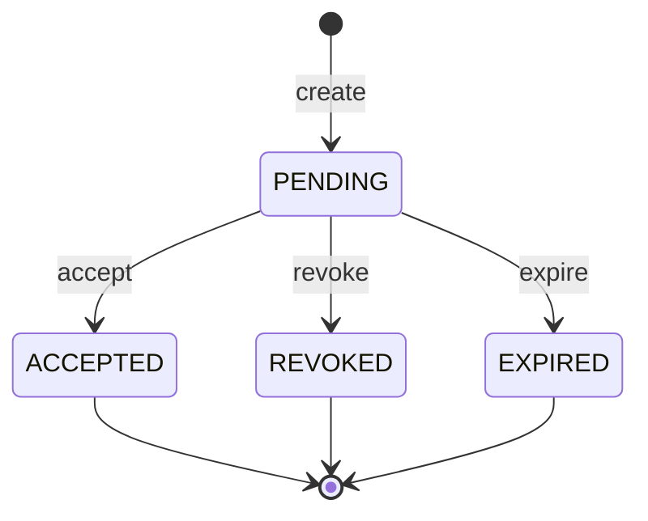

# `Invitation` Domain Model

- **Task:** E05-T05 — pending access to an organization and its
  lifecycle, following the modelling standard `Organization` (E05-T02)
  and `Membership` (E05-T04) set.
- **Status:** pure domain model only. No repositories, no persistence, no
  application services, no HTTP, no invitation tokens, no email sending,
  no acceptance workflow — all explicitly out of scope for this task
  (founder directive, opening line and Section 14).
- **Location:** `packages/tenancy/src/domain/invitation*.ts`,
  `organization-id.ts` / `user-id.ts` (reused), `email.ts`.

## Aggregate boundaries

`Invitation` is the aggregate root for one offer of access to one
organization, extended to one email address. It owns:

- its own identity (`InvitationId`),
- a reference to the organization it grants access to (`OrganizationId`
  — reused, not reimplemented, per Section 3),
- the invitee's email address (`Email`),
- a reference to who sent it (`UserId` — reused from E05-T04),
- its role (`InvitationRole`) and lifecycle status (`InvitationStatus`),
  and the timestamps that track the latter (`createdAt`, `expiresAt`,
  `respondedAt`).

It does **not** own, and this task does not model:

- **Organization**/**Membership** — separate, already-built aggregates
  (E05-T02/T04). `Invitation` references the organization by id only, and
  has no concept of the `Membership` it will eventually produce upon
  acceptance — that mapping is a future use case's job (`AcceptInvitation`,
  not yet built).
- **Invitation tokens.** Section 13/14 are explicit: no secret/token
  generation belongs in the domain. This aggregate has no `tokenHash`
  field at all — a deliberate departure from the E05-T01 scaffold's
  placeholder `InvitationRecord`, which had one (see "Non-goals" below).
- **Email delivery.** Sending the invitation is an infrastructure
  concern; this aggregate only records that an invitation *exists*, not
  that anyone was notified about it.
- **Persistence.** `InvitationRepository` (declared in
  `src/application/invitation-repository.ts`, E05-T01) has no
  implementation. Its two method signatures were mechanically updated in
  this task from the superseded `InvitationRecord` placeholder to the
  real `Invitation` aggregate — the same forced fix
  `OrganizationRepository`/`MembershipRepository` went through in
  E05-T02/T04 — but no adapter, SQL, or RLS exists yet (E05-T21).
- **Ownership transfer.** See "Role model" below.
- **Publishing.** Domain events are collected, not published by this
  aggregate itself. **Update (E05-T06):** `InvitationCreated` now has a
  wire contract and a use case that maps it —
  `INVITATION_CREATED_EVENT`/`InvitationCreatedPayload` in
  `../application/events.ts`, published by `inviteMember`
  (`invite-member-usecase.md`). The other three event types
  (`Accepted`/`Revoked`/`Expired`) still have no wire contract and no
  mapping — see "Event mapping" below.

## Value objects

### `InvitationId`

Wraps a UUID (any RFC 4122 version). Same shape, validation, and
immutability pattern as `OrganizationId`/`MembershipId` — a distinct
class, since it identifies a different kind of row.

### `OrganizationId`, `UserId` (reused)

`Invitation.organizationId` is typed as the exact `OrganizationId` class
`Organization` (E05-T02) exports; `Invitation.invitedBy` is typed as the
exact `UserId` class `Membership` (E05-T04) introduced. Neither is
reimplemented — Section 3's "reuse ... where appropriate" applied
directly.

### `Email` — a temporary, locally-scoped choice

No `Email` value object exists anywhere in `@corestack/kernel` or
`@corestack/platform` today — confirmed by search before writing this
type, the same discipline used for E05-T04's `UserId`. `Email` is
introduced here, in `@corestack/tenancy`'s own domain layer, scoped the
same way `UserId` is: not a shared primitive, flagged for deletion if a
shared identity/contact module ever introduces its own. Validation is
deliberately simple (`local@domain.tld` shape, not full RFC 5322) — this
is an invitation's destination address, not a mail-transport concern
(Section 13: no delivery concerns in the domain). Unlike `OrganizationSlug`
(which *rejects* case variance rather than normalizing it), `Email`
trims and lowercases before validating, per Section 7's explicit "email
valid and normalised" wording.

## Role model

Two roles — `ADMIN`, `MEMBER`. **No `OWNER`.** `InvitationRole` is a
narrower enum than `MembershipRole` (which has three members) — an
invitation can only ever resolve to an `ADMIN` or `MEMBER` membership.
Ownership is conferred at organization creation (`CreateOrganization`,
E05-T03) or by a separate, future ownership-transfer workflow — never by
accepting an invitation. This is enforced at the type level (the enum
itself has no `OWNER` member) *and* at runtime
(`assertValidInvitationRole`, since `Invitation.create` accepts a raw,
caller-supplied role string — unlike `Membership.create`, whose only
caller today is trusted in-process code passing an already-typed
`MembershipRole` constant). Passing `"OWNER"` gets a dedicated, explicit
rejection message distinct from the generic "unrecognized role" error,
so a future `InviteMember` command surfaces a clear reason rather than a
generic validation failure.

**Ownership transfer is out of scope here** — same non-goal
`membership-domain.md` documents: moving `OWNER` between memberships
requires coordinating two aggregate instances atomically, an
application-layer concern no single aggregate (this one or `Membership`)
can express on itself.

## Status model

Four statuses — `PENDING`, `ACCEPTED`, `REVOKED`, `EXPIRED`:



`PENDING` is the **only mutable state** — unlike `Organization`/
`Membership`, which each have exactly one terminal state, `Invitation`
has **three**, none of which transition to any other, including back to
`PENDING`. `isLegalInvitationStatusTransition(from, to)` is the single
source of truth: it has one row with three legal targets (`PENDING`) and
three rows with none (`ACCEPTED`/`REVOKED`/`EXPIRED`).

Because `accept`/`revoke`/`expire` are themselves direct status
transitions (unlike `Organization#rename`, which isn't a status
transition and needs its own separate deleted-guard), a single shared
`#transitionStatus` helper — consulting the transition table — covers
all three terminal-state checks at once. Calling `accept()` on an already
`REVOKED` invitation fails the exact same way calling it on an already
`ACCEPTED` one does: the table has no legal entry, full stop.

## Aggregate behavior

| Method | Effect | Event |
| --- | --- | --- |
| `Invitation.create(input)` | Constructs a new `PENDING` invitation | `InvitationCreated` |
| `accept(now)` | `PENDING` → `ACCEPTED`, sets `respondedAt` | `InvitationAccepted` |
| `revoke(now)` | `PENDING` → `REVOKED`, sets `respondedAt` | `InvitationRevoked` |
| `expire(now)` | `PENDING` → `EXPIRED`, sets `respondedAt` | `InvitationExpired` |

Every field is a private (`#`) class field with no public setter — these
four operations are the *only* way to change an `Invitation`'s state.

## Expiry semantics

Two distinct, deliberately separate rules govern `expiresAt`:

1. **At creation, `expiresAt` must be strictly after `now`** (Section 7)
   — enforced in `Invitation.create`. An invitation that would already be
   expired the moment it's created is rejected outright, not silently
   accepted for a future `expire()` call to clean up. Equal-to-`now` is
   also rejected ("in the future", not "now or later").
2. **`expire()` itself does not compare `now` against `expiresAt`.**
   Calling `expire()` before the invitation's own `expiresAt` has passed
   succeeds — the aggregate provides the *capability* to record
   expiration as a fact, but the *policy decision* of when to actually
   call it (a scheduled sweep comparing `expiresAt` against the current
   time, most likely) belongs to a future use case, not this aggregate.
   This mirrors `Organization.delete`/`Membership.remove`: neither
   aggregate second-guesses *why* its terminal method was called, only
   *whether* the call is structurally legal right now.

   The same absence of a clock comparison applies to `accept()`: a
   `PENDING` invitation whose `expiresAt` has already passed is still
   structurally acceptable — nothing on this aggregate compares `now`
   against `expiresAt` for *any* of the three terminal methods, not just
   `expire()`. A future `AcceptInvitation` use case is responsible for
   checking `now > expiresAt` itself (likely calling `expire()` instead
   of `accept()` when it finds a stale `PENDING` invitation) — this is
   not an oversight, but it is a real caller responsibility worth naming
   explicitly rather than leaving implicit.

The *duration* an invitation stays open (e.g. "72 hours") is an
application-layer/config concern — `tenancyConfigSpec`'s
`invitationExpiryHours` field, already defined in E05-T01 — not something
this aggregate computes. `Invitation.create` takes an already-resolved
`expiresAt: Date`, not a duration.

## Invariants

Each is enforced at the single call site named:

| Invariant | Enforced in | Failure |
| --- | --- | --- |
| Id, organizationId, invitedBy are valid UUIDs | `InvitationId.from`/`OrganizationId.from`/`UserId.from` (all called by `create`) | `ValidationError` |
| Email is valid and normalised | `Email.from` (called by `create`) — trims, lowercases, then validates shape | `ValidationError` |
| Owner role cannot be invited | `assertValidInvitationRole` (called by `create`) — `"OWNER"` gets a dedicated message; the enum itself also structurally excludes `OWNER` for any caller working with the typed value | `ValidationError` |
| `expiresAt` must be in the future at creation | An explicit check in `create`, before the aggregate is constructed | `ValidationError` |
| Terminal invitations cannot change | The status-transition table itself (`ACCEPTED`/`REVOKED`/`EXPIRED` each have no legal outgoing transitions) — the single check shared by `accept`/`revoke`/`expire` | `ConflictError` |
| `respondedAt` set exactly once | Not a separate runtime check — structurally guaranteed by the transition table: once any terminal transition fires, every subsequent call to `accept`/`revoke`/`expire` fails the transition-table check *before* `respondedAt` could be reassigned | (guaranteed by the invariant above, not independently checked) |
| Timestamps are monotonic | `#assertMonotonic` (called by every terminal method) — a `now` earlier than `createdAt` is rejected. Compared against `createdAt`, not an `updatedAt` field, since this aggregate has none (Section 6's field list has no `updatedAt` — `PENDING` is the only mutable state, and every terminal transition happens exactly once) | `ValidationError` |

## Domain events

`InvitationCreated`, `InvitationAccepted`, `InvitationRevoked`,
`InvitationExpired` — defined in `invitation-events.ts` as a
discriminated union (`InvitationDomainEvent`), each carrying
`invitationId`, `organizationId`, `occurredAt`, and (for `Created` only)
`email`/`role`/`invitedBy`/`expiresAt`.

**These are not kernel `DomainEvent`s** — same reasoning as
`OrganizationDomainEvent`/`MembershipDomainEvent`: no `actor`,
`correlationId`, `causationId`, generated `id`, or contract `version`.

### Event collection

`pullDomainEvents(): readonly InvitationDomainEvent[]` returns every
event recorded since the last clear — non-destructive.
`clearDomainEvents(): void` empties the list. Exactly one event per
successful state change; every rejected call (thrown error) records
nothing. Section 9: no shared `AggregateRoot` abstraction — the same
hand-written `pullDomainEvents`/`clearDomainEvents` pair `Organization`
and `Membership` each carry independently.

### Event mapping — partially built as of E05-T06

Unlike `Organization`/`Membership`, whose wire-level event constants
(`ORGANIZATION_CREATED_EVENT`, `MEMBER_JOINED_EVENT`, etc.) were already
defined in `../application/events.ts` during E05-T01, no `INVITATION_*`
constants existed when this doc was first written — E05-T01's Section 8
only covered organization and member event contracts.

**Update (E05-T06):** `inviteMember` (`invite-member-usecase.md`) added
`INVITATION_CREATED_EVENT` and `InvitationCreatedPayload`, and performs
the domain-event-to-wire-event mapping for `InvitationCreated`, following
the pattern E05-T03's `createOrganization` established for
`OrganizationCreated`. The other three domain event types
(`InvitationAccepted`/`InvitationRevoked`/`InvitationExpired`) still have
no wire contract and no mapping — the use cases that would produce them
(`AcceptInvitation`, a revoke command, an expiry sweep) don't exist yet.
Flagged here explicitly so the remaining gap isn't mistaken for an
oversight when discovered.

## Future invitation-token note

The E05-T01 scaffold's placeholder `InvitationRecord` had a `tokenHash`
field; this real aggregate has **none**. Section 13/14 are explicit that
token generation, hashing, and delivery are not domain concerns. A future
use case (`InviteMember`) will need to generate a single-use token,
compute its hash, and persist the hash alongside the `Invitation` row —
but that token is infrastructure/application state associated *with* an
invitation, not a fact *about* one, and so does not belong on this
aggregate. Exactly how that association is modeled (a field added later,
a separate value object, a separate table entirely) is not decided here.

## Examples

```ts
import { Invitation, InvitationRole } from "@corestack/tenancy";

const invitation = Invitation.create({
  id: "018f5a3e-7b2c-7000-8000-000000000001",
  organizationId: "018f5a3e-7b2c-7000-8000-000000000002",
  email: "Invitee@Example.COM",
  role: InvitationRole.Member,
  invitedBy: "018f5a3e-7b2c-7000-8000-000000000003",
  now: new Date(),
  expiresAt: new Date(Date.now() + 72 * 60 * 60 * 1000),
});

invitation.email.value; // "invitee@example.com" — trimmed and lowercased

invitation.accept(new Date());
// invitation.status === "ACCEPTED"; invitation.revoke(new Date()) now throws ConflictError

const revoked = Invitation.create({
  id: "018f5a3e-7b2c-7000-8000-000000000004",
  organizationId: "018f5a3e-7b2c-7000-8000-000000000002",
  email: "another@example.com",
  role: InvitationRole.Admin,
  invitedBy: "018f5a3e-7b2c-7000-8000-000000000003",
  now: new Date(),
  expiresAt: new Date(Date.now() + 72 * 60 * 60 * 1000),
});
revoked.revoke(new Date());
// revoked.accept(new Date()) now throws ConflictError

// Invitation.create({ ..., role: "OWNER" }) throws ValidationError —
// "cannot invite a member as OWNER"
```

## Non-goals (this task)

- Repositories (beyond the mechanical port-signature fix), persistence,
  HTTP handlers, invitation tokens, email sending, acceptance workflow —
  explicitly out of scope per the founder directive's opening line and
  Section 14.
- **Invitation tokens.** No `tokenHash` field, no token generation or
  hashing scheme. See "Future invitation-token note" above.
- **Ownership transfer.** No `OWNER` role can be invited; transfer of an
  existing ownership is a separate, future application-layer workflow —
  same non-goal `membership-domain.md` documents.
- **Wiring domain events into the kernel `EventBus`/`UnitOfWork`** —
  done for `InvitationCreated` as of E05-T06 (`inviteMember`); the other
  three domain event types still have no use case, wire contract, or
  wiring (see "Event mapping" above).
- **Automatic expiry.** `expire()` is a capability this aggregate
  exposes; nothing in this task decides *when* it gets called (a
  scheduled sweep, a lazy check on read, etc.) — that policy is a future
  use case's job.

## Permanent policy (adopted per Section 13, consistent with E05-T02/T04's precedents)

For all future invitation-style aggregates in this codebase:

1. `PENDING` (or the equivalent single non-terminal state) is the only
   mutable state — every other state is a dead end with no exceptions.
2. Expiry is a domain concern (the aggregate can represent "expired" and
   reject further mutation once there), but the clock comparison that
   *decides* something has expired is not — that stays with whatever
   caller has a `Clock` port.
3. Acceptance is a fact (past tense, no imperative payload) — same as
   every other domain event in this codebase.
4. Revocation is terminal, symmetric with the other two terminal
   outcomes — no special-cased "can still be revived" path.
5. No secret/token generation in the domain — tokens are an
   infrastructure/application concern layered on top, never a domain
   aggregate's own field.
6. No delivery concerns in the domain — sending an email, a Slack
   message, or any other notification is strictly outside this
   aggregate's job.
