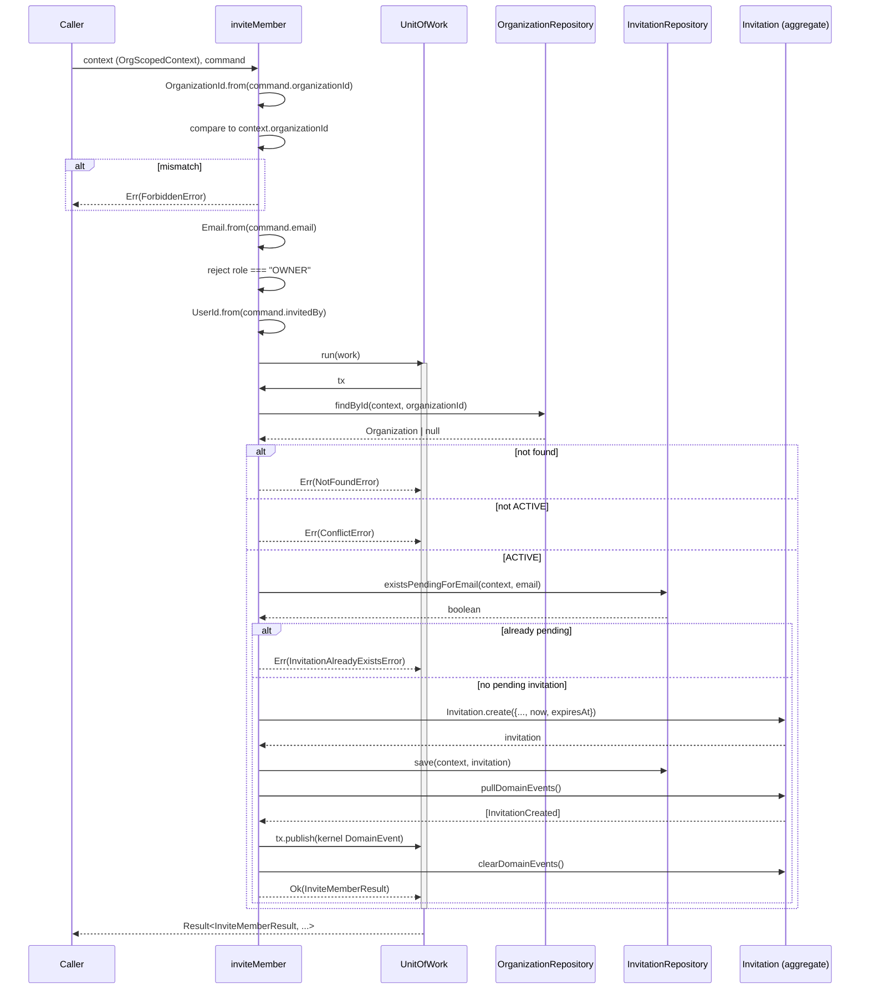

# `inviteMember` Use Case

- **Task:** E05-T06 — the second real application service in
  `@corestack/tenancy`. "Validates orchestration across Organization,
  Membership, and Invitation concepts while keeping persistence and
  delivery concerns outside the application layer" (founder directive,
  Section 1).
- **Status:** application layer only. No repository adapters, no SQL, no
  RLS, no migrations, no HTTP handlers, no email delivery, no invitation
  acceptance — all explicitly out of scope.
- **Location:** `packages/tenancy/src/application/invite-member.ts`.

## Command flow

```ts
const result = await inviteMember(context, command, {
  uow, organizationRepository, invitationRepository, ids, clock,
  invitationExpiryDays,
});
```

1. Parse `command.organizationId` via `OrganizationId.from` (identifier
   validation).
2. **Reject if it doesn't exactly equal `context.organizationId`** —
   `ForbiddenError`. See "Never trust a client-claimed organizationId"
   below.
3. Normalize the email by delegating to `Email.from` (Section 3: "trim
   email, normalise email through Email value object" — not
   re-implemented here).
4. Reject `role === "OWNER"` with `CannotInviteOwnerError`, *before*
   constructing any aggregate (Section 5).
5. Parse `command.invitedBy` via `UserId.from` (identifier validation).
6. Validate `requestId` is non-empty after trimming.
7. Look up the organization via `organizationRepository.findById`. Not
   found → `NotFoundError`. Found but not `ACTIVE` → `ConflictError`.
8. *(Skipped — see "Non-goals".)* Verify no `ACTIVE` membership exists
   for this email.
9. Check `invitationRepository.existsPendingForEmail`. A match →
   `InvitationAlreadyExistsError`.
10. Compute `expiresAt` from `deps.clock.now()` and
    `deps.invitationExpiryDays` (Section 7).
11. Construct the `Invitation` aggregate via `Invitation.create` (email
    format, owner-role lock, and expiry-in-the-future are re-validated
    here too, inside the aggregate — see "Validation layers").
12. Persist via `invitationRepository.save`.
13. Pull the aggregate's domain events, map each to a kernel
    `DomainEvent`, and stage it via `tx.publish(...)`.
14. Return `Ok(InviteMemberResult)` — a DTO, never the aggregate
    (Section 6).

Steps 7–14 (from the organization lookup onward) all run inside one
`deps.uow.run(async (tx) => { ... })` call (Section 4: "All inside a
single UnitOfWork"). Steps 1–6 (parsing/validation) run before entering
the `UnitOfWork`, matching `createOrganization`'s own structure — no
repository or persistence interaction happens until the input is already
known-well-formed.

## Sequence diagram



## Never trust a client-claimed `organizationId`

`docs/security/how-to-build-a-tenant-safe-feature.md` (step 1) is
explicit: *"Never trust a client-claimed `organizationId` directly."*
`inviteMember` takes `context: OrgScopedContext` as its first parameter —
already resolved and server-verified by the caller, per the golden path
`examples/acme-crm-module`'s `createContact` demonstrates. Section 3
still requires `organizationId` on the command, so the command carries
it — but it is **never used to construct tenant scope**. It is parsed
(`OrganizationId.from`, catching malformed input) and then checked for
exact equality against `context.organizationId`; a mismatch returns
`ForbiddenError`, not `ValidationError` — this is an authorization
signal (the caller's command disagrees with the context it was already
given), not malformed input.

This is the same two-field-same-identity shape
`create-organization-usecase.md` documents for `requestedBy` vs.
`context.actor.id` (E05-T03) — one field is authoritative, the other is
checked against it, not blindly trusted. Here, though, the resolution is
firmer: a mismatch is rejected outright (`ForbiddenError`), rather than
left as an open question for a future task, because `organizationId` is
exactly the value tenant isolation depends on — the stakes are different
in kind from `requestedBy`.

## Validation layers

Same three-layer shape `create-organization-usecase.md` established, no
layer re-validating what another already owns:

| Layer | Owns | Example |
| --- | --- | --- |
| Command (this use case) | Fields with no domain concept of their own, plus the context/command consistency check | `requestId` non-empty after trim; `organizationId` matches `context.organizationId`; `role !== "OWNER"` (dedicated error, checked before the aggregate's own generic one) |
| Value objects (`OrganizationId`, `Email`, `UserId`, E05-T02/T04/T05) | Format | UUID shape; email shape, trimmed and lowercased |
| Aggregate (`Invitation.create`, E05-T05) | Everything about constructing a valid invitation | Email re-validated as part of construction, owner-role rejected again via `assertValidInvitationRole` (defense-in-depth), `expiresAt` strictly after `now` |

The owner-role check happens **twice** in the call sequence — once in
this use case (returning the dedicated `CannotInviteOwnerError`), once
inside `Invitation.create` (`assertValidInvitationRole`, returning a
generic `ValidationError`) — but a caller going through `inviteMember`
should never actually observe the second one; the use case's own check
runs first and short-circuits. The aggregate's check stays as
defense-in-depth for any *other* future caller of `Invitation.create`
that doesn't route through this use case, not because this use case
needs it.

## Expiry policy

Section 7: "introduce an application-level expiry policy... compute
`expiresAt` in the use case... do not add clock logic to the aggregate."
`InviteMemberDeps.invitationExpiryDays` (read from
`tenancyConfigSpec`'s new `invitationExpiryDays` field, default 7) and
`deps.clock.now()` are combined here — `addDays(now, invitationExpiryDays)`
— and the *result* is passed to `Invitation.create`, which only ever
validates that the resulting instant is strictly after `now`
(E05-T05's own invariant). The aggregate never reads a clock or a
duration itself.

### A config-surface note: `invitationExpiryHours` vs. `invitationExpiryDays`

`tenancyConfigSpec` already had an `invitationExpiryHours` field,
declared in E05-T01 with a default of 72. Before adding
`invitationExpiryDays` (this task's Section 7 instruction), a search
confirmed `invitationExpiryHours` and `resolveTenancyConfig` are **never
read by any code** — E05-T01 declared the field; nothing consumed it
until now. Given that, three options were considered:

1. Repurpose `invitationExpiryHours` for this use case, changing its
   default to 168 (7 days in hours) to match Section 7's requested
   default.
2. Add `invitationExpiryDays` alongside the existing field, leaving
   `invitationExpiryHours` untouched.
3. Flag a genuine two-knob conflict and resolve neither.

Option 1 was rejected: changing a shipped, documented default (72) is a
real behavior change Section 7 never asked for — it asked to *add* a
field, not *repurpose* one. Option 3 doesn't apply either, since there is
no live conflict to flag — `invitationExpiryHours` governs nothing today.
**Option 2 was taken**: `invitationExpiryDays` (default 7) is the field
`inviteMember` actually reads; `invitationExpiryHours` (default 72) is
left exactly as E05-T01 built it, now explicitly marked in `config.ts`'s
own comment as superseded-but-not-removed. Removing a declared config
field is a config-surface cleanup outside this task's Section 2 scope,
not a decision made here.

## Duplicate handling

`InvitationAlreadyExistsError` (extends kernel's `ConflictError`) is
returned when `existsPendingForEmail` reports a match. On this path: no
aggregate is constructed, nothing is persisted, no event is published —
same shape as `DuplicateSlugError`'s handling in `createOrganization`.

**Not yet a hard uniqueness guarantee**, for the same reason
`create-organization-usecase.md` documents for `existsBySlug`: the
in-memory reference `UnitOfWork` provides no isolation, and even a real
Postgres transaction doesn't prevent two concurrent `inviteMember` calls
for the same email from both passing `existsPendingForEmail` before
either `save`s — that requires a real uniqueness constraint, which
doesn't exist until E05-T21's migration. Recorded here as a known gap,
not silently assumed solved (Section 12: "duplicate checks are
best-effort until database constraints exist").

## Event flow

`Invitation.create()` only ever produces one domain event,
`InvitationCreated` (E05-T05). This use case maps it to the kernel
`DomainEvent` envelope:

```ts
createEvent<InvitationCreatedPayload>(
  {
    name: INVITATION_CREATED_EVENT, // "invitation.created"
    version: 1,
    organizationId: event.organizationId,
    payload: { invitationId, organizationId, email, role, invitedBy, expiresAt: expiresAt.toISOString() },
  },
  context,
  { clock, ids },
)
```

**No `INVITATION_*` wire contract existed before this task.**
`docs/modules/invitation-domain.md` (E05-T05) flagged this gap
explicitly: unlike `Organization`/`Membership`, whose event constants
were defined in E05-T01, invitation event contracts were never added.
This task adds `INVITATION_CREATED_EVENT` and `InvitationCreatedPayload`
to `application/events.ts` — the first (and, so far, only) invitation
wire event. `InvitationCreatedPayload.role` is typed `"ADMIN" | "MEMBER"`
(matching `InvitationRole`'s actual uppercase values exactly), unlike
the pre-existing `MemberJoinedPayload.role` (lowercase — a T01 artifact
predating the real `MembershipRole` enum); authored fresh against the
real aggregate, this payload follows the domain model instead of
perpetuating that earlier mismatch. `expiresAt` is a `string` (ISO), not
`Date` — event payloads must be JSON-serializable, and unlike the
envelope's own `occurredAt`, nested payload fields aren't
auto-reconstructed into `Date` on deserialization. No `tokenHash`/token
field — `Invitation` has none (E05-T05).

The other three `InvitationDomainEvent` types (`Accepted`/`Revoked`/
`Expired`) have no mapping here — `Invitation.create()` never produces
them, and the use cases that would (`AcceptInvitation`, a revoke
command, an expiry sweep) don't exist yet. The `for` loop that maps
domain events to wire events explicitly skips any event whose `type`
isn't `"InvitationCreated"`, mirroring `createOrganization`'s identical
pattern.

## Non-goals

- **Repository adapters, SQL, RLS, migrations, HTTP handlers, email
  delivery, invitation acceptance, token generation** — explicitly out
  of scope per the founder directive's opening line and Section 13.
- **The active-membership check (Section 4 step 2).** "Verify no ACTIVE
  membership already exists for the email/user *if the repository can
  determine it*" — it cannot. `Membership` keys off `userId` (E05-T04),
  not email; there is no `User` aggregate or repository anywhere in this
  codebase, and therefore no email→userId mapping to resolve one into
  the other. This step is genuinely unrepresentable with what exists
  today, not merely skipped for convenience — no new method was added to
  `MembershipRepository` to fake a partial version of it, and
  `InviteMemberDeps` deliberately has no `membershipRepository` field at
  all.
- ~~**Authorization — is the inviter permitted to invite?**~~ **Resolved
  in E05-T07.** This gap (any caller holding a valid `OrgScopedContext`
  could invite regardless of their own membership or role) is now closed:
  `inviteMember` looks up the inviter's own `ACTIVE` membership via
  `membershipRepository.findByUserId` and checks it against `canInviteAs`
  (only `OWNER`/`ADMIN` may invite, `ADMIN` may not invite `ADMIN`,
  nobody may invite `OWNER`), returning `InviterNotAuthorizedError` on
  failure. See
  [accept-invitation-usecase.md](accept-invitation-usecase.md)'s
  "Authorization matrix" for the full rule and
  `packages/tenancy/src/application/invite-authorization.ts` for the
  implementation. This document's own flow/sequence-diagram sections
  above predate E05-T07 and describe the E05-T06 shape only — they are
  left as the historical record of what E05-T06 itself shipped, not
  updated to reflect T07's addition.
- **A hard duplicate-invitation guarantee** — see "Duplicate handling"
  above; E05-T21's job.
- **`requestId` propagation** — validated for presence only, same
  non-goal `createOrganization` documents for its own `requestId`.
- **Wiring into `createTenancyModule`'s `useCases`** — `TenancyUseCases`
  remains `Record<string, never>` until a future task wires commands into
  the module factory.
- **The 3-state vs. 4-state organization-model reconciliation**
  (E05-T02's open item) — explicitly not touched here (Section 13).
  `Organization.status` is read (must be `ACTIVE`) but the status model
  itself is untouched.
- **Removing the now-superseded `invitationExpiryHours` config field** —
  see "A config-surface note" above; a cleanup task, not this one.
