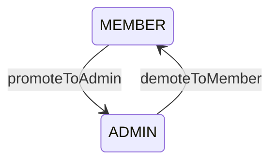
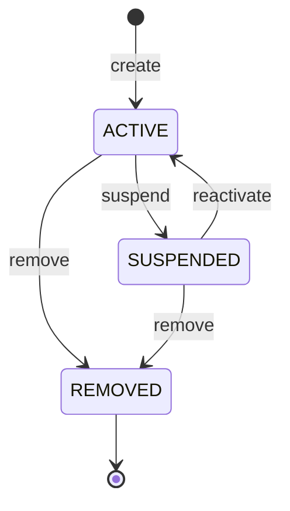

# `Membership` Domain Model

- **Task:** E05-T04 — organization membership, role assignment, and
  lifecycle rules, following the modelling standard `Organization`
  (E05-T02) set.
- **Status:** pure domain model only. No repositories, no persistence, no
  application services, no HTTP, no invitation flows — all explicitly out
  of scope for this task (founder directive, opening line).
- **Location:** `packages/tenancy/src/domain/membership*.ts`,
  `organization-id.ts` (reused), `user-id.ts`.

## Aggregate boundaries

`Membership` is the aggregate root for one user's relationship to one
organization. It owns:

- its own identity (`MembershipId`),
- a reference to the organization it belongs to (`OrganizationId` —
  reused, not reimplemented, per Section 3),
- a reference to the user it belongs to (`UserId` — see "Value objects"
  below for why this is a new, temporary type),
- its role (`MembershipRole`) and its lifecycle status
  (`MembershipStatus`), and the timestamps that track the latter
  (`joinedAt`, `updatedAt`, `removedAt`).

It does **not** own, and this task does not model:

- **Organization** — a separate, already-built aggregate (E05-T02).
  `Membership` references it by id only; it never reaches into
  `Organization`'s own state or methods.
- **Invitation** — a separate future aggregate. Explicitly out of scope
  per Section 15 ("do not introduce Invitation ... concepts beyond what
  is strictly required for Membership").
- **User management** — no user profile, no auth, no session concept.
  `UserId` (below) is the only user-related surface this task touches.
- **Persistence** — `MembershipRepository` (declared in
  `src/application/membership-repository.ts`, E05-T01) has no
  implementation. Its two method signatures were mechanically updated
  in this task from the superseded `MembershipRecord` placeholder to the
  real `Membership` aggregate — the same forced fix
  `OrganizationRepository` went through in E05-T02 — but no adapter, SQL,
  or RLS exists yet (E05-T21).
- **Ownership transfer.** See "Role model" and "Non-goals" below.
- **Publishing.** Domain events are collected, not published — no use
  case exists yet to map them onto the wire-level contract already
  defined in `../application/events.ts` (E05-T01), the same gap
  `organization-domain.md` documents for `Organization`'s non-`Created`
  events.

## Value objects

### `MembershipId`

Wraps a UUID (any RFC 4122 version). Same shape, validation, and
immutability pattern as `OrganizationId` — a distinct class, not a reuse
of it, since it identifies a different kind of row (the membership
itself, not the organization).

### `OrganizationId` (reused)

`Membership.organizationId` is typed as `OrganizationId`, the exact class
`Organization` (E05-T02) already exports — not a parallel, duplicate
value object. This is Section 3's "reuse `OrganizationId` where
appropriate" applied directly: the id space for "an organization" is one
concept, shared by both aggregates that reference it.

### `UserId` — a temporary, locally-scoped choice

No `UserId` exists anywhere in `@corestack/kernel` or `@corestack/platform`
today — confirmed by search before writing this type, not assumed. There
is no user-identity/auth module in this repo yet; that is out of scope
for the Tenancy epic entirely. `UserId` is introduced here, in
`@corestack/tenancy`'s own domain layer, purely so `Membership.userId` is
typed rather than a bare `string`. It is **not** intended as a
shared identity primitive for the rest of the platform. If/when a real
identity module introduces its own `UserId`, this local type should be
deleted and `Membership` updated to import that one instead — flagged
here explicitly so it is not mistaken for a permanent architectural home
for user identity.

## Role model

Three roles — `OWNER`, `ADMIN`, `MEMBER`:



`OWNER` is deliberately absent from this diagram: it has no outgoing
transition through this aggregate at all — not because it is a lifecycle
terminal (the way `MembershipStatus.Removed` is), but because this
aggregate structurally locks it. An owner cannot be downgraded to
`ADMIN`/`MEMBER` (`promoteToAdmin`/`demoteToMember` both reject when the
current role is `OWNER`) and cannot be removed (`remove` rejects
regardless of status when the current role is `OWNER`). There are also no
role self-transitions: calling `promoteToAdmin` on an existing `ADMIN` is
an invalid transition, not a no-op (Section 8's "self-transition no-ops
allowed only where explicitly documented" — none are documented for
roles). `isLegalMembershipRoleTransition(from, to)` is the single source
of truth for the diagram above.

**Ownership transfer is a separate, future use case** (Section 15,
explicitly not resolved here). This aggregate has no method that moves
`OWNER` onto a different membership or off of the current one — that
requires coordinating *two* memberships atomically (the outgoing owner
and the incoming one), which is an application-layer concern, not
something a single aggregate instance can do to itself.

## Status model

Three statuses — `ACTIVE`, `SUSPENDED`, `REMOVED`:



`REMOVED` is terminal: every transition attempted *from* `REMOVED` is
illegal, including a repeat `remove()`. No self-transitions — calling
`suspend()` on an already-`SUSPENDED` membership is an **error**, not a
no-op. `isLegalMembershipStatusTransition(from, to)` is the single source
of truth.

Status and role are **independent axes**: suspending or reactivating a
membership never changes its role (an `OWNER` can be suspended and
reactivated — nothing in Section 4/5 forbids it, only demotion and
removal are locked), and promoting/demoting never changes status.

## Aggregate behavior

| Method | Effect | Event |
| --- | --- | --- |
| `Membership.create(input)` | Constructs a new `ACTIVE` membership at the given role | `MembershipCreated` |
| `promoteToAdmin(now)` | `MEMBER` → `ADMIN` | `MembershipPromoted` |
| `demoteToMember(now)` | `ADMIN` → `MEMBER` | `MembershipDemoted` |
| `suspend(now)` | `ACTIVE` → `SUSPENDED` | `MembershipSuspended` |
| `reactivate(now)` | `SUSPENDED` → `ACTIVE` | `MembershipReactivated` |
| `remove(now)` | `ACTIVE`/`SUSPENDED` → `REMOVED`, sets `removedAt` (rejected outright if role is `OWNER`) | `MembershipRemoved` |

Every field is a private (`#`) class field with no public setter — these
six operations are the *only* way to change a `Membership`'s state
("no public mutable fields", Section 6, enforced structurally).

## Invariants

Each is enforced at the single call site named:

| Invariant | Enforced in | Failure |
| --- | --- | --- |
| Id, organizationId, userId are valid UUIDs | `MembershipId.from`/`OrganizationId.from`/`UserId.from` (all called by `create`) | `ValidationError` |
| A removed membership cannot change | `#assertNotRemoved` (called by `promoteToAdmin`/`demoteToMember`); the status-transition table itself (called by `suspend`/`reactivate`/`remove`, since `REMOVED` has no legal outgoing transitions) | `ConflictError` |
| Owner cannot be demoted | The role-transition table (`OWNER` has no outgoing entries) — both `promoteToAdmin` and `demoteToMember` reject when current role is `OWNER` | `ConflictError` |
| Owner cannot be removed | An explicit check in `remove`, run *before* the status-transition table — removal-of-an-owner is illegal regardless of current status, not merely absent from the table | `ConflictError` |
| Self-transitions are not silent no-ops | Neither the role table nor the status table has any self-transition entries — calling `promoteToAdmin` on an `ADMIN`, or `suspend` on a `SUSPENDED` membership, is an invalid transition. (The only no-op precedent in this codebase is `Organization#rename`-to-same-name; `Membership` has no equivalent field-level no-op, so none is documented and none exists.) | `ConflictError` |
| Timestamps are monotonic | `#assertMonotonic` (called by every mutating method) — a `now` earlier than `updatedAt` is rejected; equal is accepted | `ValidationError` |

The "reject, don't clamp" choice for the monotonic invariant matches
`Organization`'s: a caller passing a stale clock reading is a bug worth
surfacing.

## Domain events

`MembershipCreated`, `MembershipPromoted`, `MembershipDemoted`,
`MembershipSuspended`, `MembershipReactivated`, `MembershipRemoved` —
defined in `membership-events.ts` as a discriminated union
(`MembershipDomainEvent`), each carrying `membershipId`, `organizationId`,
`occurredAt`, and the relevant payload fields only (`MembershipCreated`
also carries `userId`/`role`; `Promoted`/`Demoted` carry
`previousRole`/`role`).

**These are not kernel `DomainEvent`s** — same reasoning as
`OrganizationDomainEvent`: no `actor`, `correlationId`, `causationId`,
generated `id`, or contract `version`. The aggregate holds no `Context`
and no `IdGenerator`.

### Event collection

`pullDomainEvents(): readonly MembershipDomainEvent[]` returns every event
recorded since the last clear — non-destructive. `clearDomainEvents(): void`
empties the list. Exactly one event is recorded per successful state
change; every rejected call (thrown error) records nothing. Section 9: no
shared `AggregateRoot` abstraction was introduced — the same local
`pullDomainEvents`/`clearDomainEvents` pair is hand-written on this class,
mirroring `Organization`'s.

### Event mapping — not built here

No use case consumes `Membership`'s domain events yet (Section 2 is
domain-only). The wire-level contract this will eventually map onto
(`MEMBER_JOINED_EVENT`/`MEMBER_UPDATED_EVENT`/`MEMBER_REMOVED_EVENT`,
`MemberJoinedPayload`, etc.) was already defined in
`packages/tenancy/src/application/events.ts` during E05-T01. A future use
case will follow the exact pattern E05-T03's `createOrganization`
established: `pullDomainEvents()`, construct a kernel `DomainEvent` via
`createEvent(...)`, publish through `UnitOfWork`, `clearDomainEvents()`.

## Examples

```ts
import { Membership, MembershipRole } from "@corestack/tenancy";

const membership = Membership.create({
  id: "018f5a3e-7b2c-7000-8000-000000000001",
  organizationId: "018f5a3e-7b2c-7000-8000-000000000002",
  userId: "018f5a3e-7b2c-7000-8000-000000000003",
  role: MembershipRole.Member,
  now: new Date(),
});

membership.promoteToAdmin(new Date());
membership.suspend(new Date());
membership.reactivate(new Date());
membership.demoteToMember(new Date());

const events = membership.pullDomainEvents();
// [MembershipCreated, MembershipPromoted, MembershipSuspended, MembershipReactivated, MembershipDemoted]
membership.clearDomainEvents();

membership.remove(new Date());
// membership.status === "REMOVED"; membership.suspend(new Date()) now throws ConflictError

const owner = Membership.create({
  id: "018f5a3e-7b2c-7000-8000-000000000004",
  organizationId: "018f5a3e-7b2c-7000-8000-000000000002",
  userId: "018f5a3e-7b2c-7000-8000-000000000005",
  role: MembershipRole.Owner,
  now: new Date(),
});
// owner.demoteToMember(new Date()) and owner.remove(new Date()) both throw ConflictError
```

## Non-goals (this task)

- Repositories (beyond the mechanical port-signature fix), persistence,
  HTTP handlers, invitation flows — explicitly out of scope per the
  founder directive's opening line.
- **Ownership transfer.** No method moves `OWNER` between memberships.
  This requires an application-layer use case coordinating two
  `Membership` instances atomically (and, in practice, a
  `UnitOfWork`-scoped transaction) — a single aggregate cannot express
  "the outgoing owner becomes admin and the incoming admin becomes owner"
  as one of its own methods without violating "one method changes one
  aggregate instance." Tracked here as open, not designed.
- **Invitation** — a separate future aggregate; not introduced (Section
  15).
- **User management/auth** — `UserId` is a minimal, temporary value
  object (see "Value objects" above), not a user profile or identity
  system.
- Wiring domain events into the kernel `EventBus`/`UnitOfWork` — no use
  case exists yet to do the wiring (same gap `organization-domain.md`
  documents for `Organization`'s non-`Created` events).

## Permanent policy (adopted per Section 13, consistent with E05-T02's Section 12)

For all future aggregates in this codebase:

1. Ownership rules are explicit — encoded in the transition table
   structure (`OWNER` has no outgoing role entries) and in a dedicated
   guard where the table alone can't express the rule (`remove`'s
   owner check, which runs before — not instead of — the status table).
2. Terminal states are enforced structurally, not by a runtime `if`
   scattered at call sites.
3. Role/status transitions are intentional — a named method per legal
   change, no generic `setRole`/`setStatus`.
4. Events describe facts (past tense, no imperative payload).
5. No infrastructure in domain code — no `Context`, `IdGenerator`, or
   `Clock` port dependency inside the aggregate.
6. No speculative shared base classes — `pullDomainEvents`/
   `clearDomainEvents` are hand-written per aggregate until a second real
   need for shared behavior actually appears.
