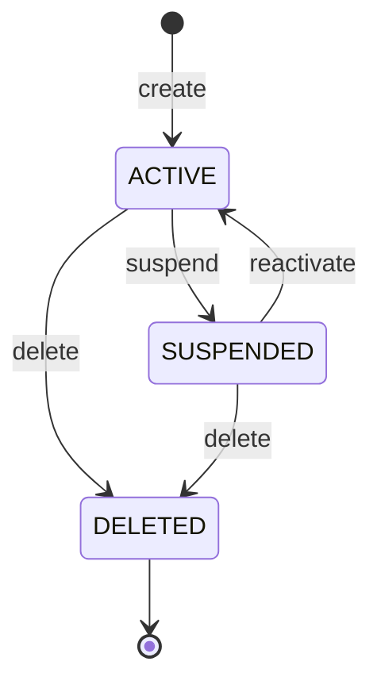

# `Organization` Domain Model

- **Task:** E05-T02 — the first real business aggregate in CoreStack.
  "Sets the modelling standard for all future modules" (founder
  directive, Section 1).
- **Status:** pure domain model only. No repositories, no persistence, no
  application services, no HTTP, no background jobs — all explicitly out
  of scope for this task.
- **Location:** `packages/tenancy/src/domain/organization*.ts`.

## Aggregate boundaries

`Organization` is the aggregate root for this slice of the tenancy
module. It owns:

- its own identity (`OrganizationId`),
- its own slug (`OrganizationSlug`),
- its name,
- its lifecycle status (`OrganizationStatus`) and the timestamps that
  track it (`createdAt`, `updatedAt`, `deletedAt`).

It does **not** own, and this task does not model:

- **Membership** — a separate future aggregate (E05-T03). `Organization`
  has no concept of members, roles, or an owner in this task's code (the
  transfer-ownership and sole-owner-guard rules in
  [tenancy-contract.md](tenancy-contract.md) are `Membership`'s concern).
- **Invitation** — separate future aggregate (E05-T04).
- **Persistence** — `OrganizationRepository` (already declared in
  `src/application/organization-repository.ts`, E05-T01) has no
  implementation. This aggregate is what a future Postgres adapter
  (E05-T21) will reconstruct from rows and persist back, but that mapping
  doesn't exist yet.
- **Publishing** — see "Event mapping" below.
- **`kind` (`personal`/`team`)** — the E05-T01 scaffold's placeholder
  `OrganizationRecord` (now superseded, deleted) had this field;
  `tenancy-contract.md`'s blueprint reference also names it. This task's
  Section 5 field list does not include it, so it is not modeled. Not a
  silent omission: a personal-vs-team distinction is a real future
  decision (E05-T02's directive scope is exactly the three-status,
  no-`kind` model below), tracked here rather than guessed at.

## Value objects

### `OrganizationId`

Wraps a UUID (any RFC 4122 version, not restricted to v7 — the
platform's `UuidGenerator` happens to emit v7, but this type doesn't
assume its own caller). Validated once at construction (`OrganizationId.from`);
every holder of an instance can treat it as already-valid. Normalized to
lowercase so equality doesn't depend on the input's casing. Immutable:
private field, no setter, frozen instance.

### `OrganizationSlug`

3–50 characters; lowercase letters, digits, and single hyphens between
non-empty segments. Rejects rather than normalizes an invalid or
uppercase input — a caller that wants case-insensitive slug matching must
lowercase before calling `from`, so this type's string representation
never silently disagrees with what was passed in.

## Status model

Three statuses — `ACTIVE`, `SUSPENDED`, `DELETED` — not the four
(`active`/`suspended`/`pending_deletion`/`purged`) sketched in
[tenancy-contract.md](tenancy-contract.md)'s forward-looking two-phase-delete
design. See "Non-goals" below for why that's an open reconciliation, not
a silent regression.



`DELETED` is terminal: every transition attempted *from* `DELETED` is
illegal, including a repeat `delete()`. There are deliberately no
self-transitions — calling `suspend()` on an already-`SUSPENDED`
organization is an **error**, not a no-op (distinct from `rename`, see
below). `isLegalOrganizationStatusTransition(from, to)` is the single
source of truth for the table above; nothing else re-encodes it.

## Aggregate behavior

| Method | Effect | Event |
| --- | --- | --- |
| `Organization.create(input)` | Constructs a new `ACTIVE` organization | `OrganizationCreated` |
| `rename(name, now)` | Changes the name | `OrganizationRenamed` — **unless** `name` equals the current name, which is a no-op: no event, `updatedAt` unchanged |
| `suspend(now)` | `ACTIVE` → `SUSPENDED` | `OrganizationSuspended` |
| `reactivate(now)` | `SUSPENDED` → `ACTIVE` | `OrganizationReactivated` |
| `delete(now)` | `ACTIVE`/`SUSPENDED` → `DELETED`, sets `deletedAt` | `OrganizationDeleted` |

Every field is a private (`#`) class field. There is no public setter
anywhere — these five operations (four methods plus the `create` factory)
are the *only* way to change an `Organization`'s state. "No public
mutable fields" (Section 5) is enforced structurally, not by convention:
there is no way to bypass a method and mutate a field directly, at the
type level, from outside the class.

## Invariants

Each is enforced at the single call site named, not scattered:

| Invariant | Enforced in | Failure |
| --- | --- | --- |
| Name is required, 1–120 characters | `assertValidName` (called by `create` and `rename`) | `ValidationError` |
| Slug is valid (3–50 chars, lowercase, hyphen rules) | `OrganizationSlug.from` (called by `create`) | `ValidationError` |
| Id is a valid UUID | `OrganizationId.from` (called by `create`) | `ValidationError` |
| A deleted organization cannot change | `#assertNotDeleted` (called by `rename`); the status-transition table itself (called by `suspend`/`reactivate`/`delete`, since `DELETED` has no legal outgoing transitions) | `ConflictError` |
| Rename to the current value is a no-op | `rename`'s own early-return, before the monotonic check or any mutation | (no error — silently succeeds as a no-op) |
| `suspend`/`reactivate` must change state | The transition table has no self-transitions, so a same-state call is simply an illegal transition | `ConflictError` |
| Timestamps are monotonic | `#assertMonotonic` (called by every mutating method) — a `now` earlier than the aggregate's `updatedAt` is rejected; a `now` **equal** to `updatedAt` is accepted | `ValidationError` |

The "reject, don't clamp" choice for the monotonic invariant is
deliberate: a caller passing a stale clock reading is a bug in that
caller, and silently clamping the timestamp would hide it instead of
surfacing it.

## Domain events

`OrganizationCreated`, `OrganizationRenamed`, `OrganizationSuspended`,
`OrganizationReactivated`, `OrganizationDeleted` — defined in
`organization-events.ts` as a discriminated union (`OrganizationDomainEvent`),
each carrying `organizationId`, `occurredAt`, and the relevant payload
fields only (e.g. `OrganizationRenamed` carries `previousName`/`name`).

**These are not kernel `DomainEvent`s.** `@corestack/kernel`'s envelope
(`event.ts`) carries `actor`, `correlationId`, `causationId`, a generated
`id`, and a contract `version` — all request/infrastructure concerns the
aggregate has no access to (it holds no `Context`, no `IdGenerator`). A
domain event here is only the fact that something happened.

### Event collection

`pullDomainEvents(): readonly OrganizationDomainEvent[]` returns every
event recorded since the last clear — **non-destructive**, it can be
called any number of times without side effects. `clearDomainEvents(): void`
empties the list. Exactly one event is recorded per successful state
change; a no-op `rename` and every rejected call (thrown error) record
nothing.

### Event mapping (built in E05-T03, for `OrganizationCreated` only)

`createOrganization` (E05-T03) is the first use case to perform this
mapping, for the creation path only:

1. Call `Organization.create(...)`.
2. `pullDomainEvents()` to read what happened.
3. For the `OrganizationCreated` domain event, construct a kernel
   `DomainEvent` via `createEvent(...)` with the resolved `Context`/
   `IdGenerator`.
4. Publish it through the `UnitOfWork`'s transaction context — the same
   pattern `examples/acme-crm-module`'s `createContact` use case
   demonstrates for its own domain.
5. `clearDomainEvents()` once publishing is staged.

The wire-level contract this maps onto (`ORGANIZATION_CREATED_EVENT`,
`OrganizationCreatedPayload`) was defined in
`packages/tenancy/src/application/events.ts` during E05-T01 and adjusted
in E05-T03 (the `kind` field was dropped — see
[create-organization-usecase.md](create-organization-usecase.md)). The two
remain intentionally decoupled — the domain event is a fact about the
aggregate, the wire event is what gets published. The other four domain
events (`Renamed`/`Suspended`/`Reactivated`/`Deleted`) have no use case
yet and are not published anywhere.

## Examples

```ts
import { Organization } from "@corestack/tenancy";

const org = Organization.create({
  id: "018f5a3e-7b2c-7000-8000-000000000001",
  name: "Acme Corp",
  slug: "acme-corp",
  now: new Date(),
});

org.rename("Acme Corporation", new Date());
org.suspend(new Date());
org.reactivate(new Date());

const events = org.pullDomainEvents();
// [OrganizationCreated, OrganizationRenamed, OrganizationSuspended, OrganizationReactivated]
org.clearDomainEvents();

org.delete(new Date());
// org.status === "DELETED"; org.suspend(new Date()) now throws ConflictError
```

## Non-goals (this task)

- Repositories, persistence, HTTP handlers, background jobs — explicitly
  out of scope per the founder directive's opening line.
- `Membership`/`Invitation` aggregates (E05-T03/T04).
- The `kind` (`personal`/`team`) field from the T01 placeholder and the
  contract doc's blueprint reference — not modeled; see "Aggregate
  boundaries" above.
- The four-state, two-phase-delete status machine
  (`pending_deletion`/`purged`) `tenancy-contract.md` sketches for E05-T13's
  purge protocol. This task's three-state model (`ACTIVE`/`SUSPENDED`/`DELETED`)
  is the founder directive's explicit Section 4 scope. **Open
  reconciliation**: whichever future task wires `Organization` into the
  purge protocol (E05-T13) must decide whether `DELETED` here becomes
  `tenancy-contract.md`'s `pending_deletion` (with a separate `purged`
  state added later) or whether the two-phase flow is modeled a different
  way entirely. Not decided here — flagged so it isn't silently assumed
  either way.
- Wiring domain events into the kernel `EventBus`/`UnitOfWork` (see "Event
  mapping" above) — no use case exists yet to do the wiring.

## Permanent policy (adopted per Section 12)

For all future aggregates in this codebase:

1. Value objects first.
2. Explicit transitions (a named method per legal state change, not a
   generic `setStatus`).
3. Terminal states are enforced structurally (the transition table has no
   outgoing entries), not by a runtime `if` scattered at call sites.
4. No public mutation — private fields, methods only.
5. Events are facts, not commands (past tense, no imperative payload).
6. No infrastructure leakage — domain events are not kernel `DomainEvent`s;
   no `Context`, `IdGenerator`, or `Clock` port dependency inside the
   aggregate itself.
7. No ORM annotations or persistence-shape concessions in domain code.
8. Invariants documented in TSDoc at the exact call site that enforces
   them, not in a separate design note that can drift from the code.
