# Tenancy Postgres Schema Design (E05-T09)

- **Status:** design only — freezes the database shape; no repository
  adapter, no SQL migration beyond the schema definitions themselves, no
  RLS policy is implemented here (Section 2/16 of the founder directive).
- **Scope:** `packages/tenancy/src/infrastructure/postgres/schema/` —
  Drizzle table definitions for `organizations`, `memberships`,
  `invitations`, plus everything a future adapter/RLS task needs to know
  before touching either.
- **Companion doc:**
  [tenancy-persistence-mapping.md](tenancy-persistence-mapping.md) covers
  the field-by-field aggregate→row mapping this doc's index/uniqueness
  rationale builds on.
- **Reconciles with:** `docs/architecture/DATABASE.md` §5 (the forward
  blueprint) — every deliberate deviation from that blueprint is called
  out explicitly below, per this task's own instruction: "do not resolve
  the 3-state vs 4-state organization reconciliation here; use the
  implemented domain model" (Section 7).

## ER diagram

```mermaid
erDiagram
    organizations ||--o{ memberships : "has"
    organizations ||--o{ invitations : "issues"

    organizations {
        uuid id PK
        text slug UK
        text name
        text status "ACTIVE/SUSPENDED/DELETED"
        timestamptz created_at
        timestamptz updated_at
        timestamptz deleted_at "NULL unless DELETED"
    }

    memberships {
        uuid id PK
        uuid organization_id FK
        uuid user_id "by-id, no FK (no auth schema yet)"
        text role "OWNER/ADMIN/MEMBER"
        text status "ACTIVE/SUSPENDED/REMOVED"
        timestamptz joined_at
        timestamptz updated_at
        timestamptz removed_at "NULL unless REMOVED"
    }

    invitations {
        uuid id PK
        uuid organization_id FK
        text email "lowercase-normalized"
        text role "ADMIN/MEMBER, never OWNER"
        text status "PENDING/ACCEPTED/REVOKED/EXPIRED"
        uuid invited_by "by-id, no FK"
        timestamptz created_at
        timestamptz expires_at
        timestamptz responded_at "NULL while PENDING"
    }
```

`user_id` (on `memberships`) and `invited_by` (on `invitations`) are
by-id references into a schema this module doesn't own — no `auth`
schema exists yet in this codebase, and DATABASE.md §1 rule 4 forbids
cross-schema foreign keys regardless ("cross-schema FKs would fuse
migration order and deletion order across modules — precisely the
coupling module boundaries exist to prevent").

## Index rationale

| Table | Index | Kind | Backs |
| --- | --- | --- | --- |
| `organizations` | `organizations_slug_key` on `(slug)` | plain unique | `existsBySlug` (duplicate-slug rejection at creation) |
| `organizations` | `organizations_status_idx` on `(status)` | plain btree | Filtering by lifecycle status (e.g. a future "list active organizations" admin query) |
| `memberships` | `memberships_active_org_user_key` on `(organization_id, user_id)` | **partial** unique, `WHERE status = 'ACTIVE'` | The active-membership rule (Section 5); also backs `existsActive`, whose query shape (org + user + `status = 'ACTIVE'`) matches this index exactly — see "Membership uniqueness strategy" below |
| `memberships` | `memberships_org_user_idx` on `(organization_id, user_id)` | plain btree | `findByUserId` (all statuses, not just `ACTIVE` — the partial index above can't serve a status-agnostic lookup) |
| `invitations` | `invitations_pending_org_email_key` on `(organization_id, email)` | **partial** unique, `WHERE status = 'PENDING'` | The one-pending-invitation rule (Section 6) — see "Invitation uniqueness strategy" below |
| `invitations` | `invitations_organization_idx` on `(organization_id)` | plain btree | `listForOrganization` (all statuses) |

No index exists that isn't backed by a real, currently-implemented
repository method or an explicit Section 4/5/6 requirement — Section 14's
adopted policy ("no ORM-driven implicit constraints") reads equally as
"no speculative indexes, either."

## Partial-index rationale

Both partial unique indexes exist because the *uniqueness rule* is
conditional on lifecycle state, not on the full row set — an ordinary
`UNIQUE` constraint can't express "unique among rows in this state," only
"unique across all rows ever." Drizzle's `uniqueIndex(...).where(...)`
(backed by Postgres's native partial-index support) is the direct
mechanism.

### Membership uniqueness strategy

**Rule:** at most one `ACTIVE` membership per `(organization_id,
user_id)` — Section 5's literal wording: "one active membership per
organization + user."

**Scope decision, made explicitly:** the partial index is scoped to
`status = 'ACTIVE'` only, **not** `status IN ('ACTIVE', 'SUSPENDED')`
("not `REMOVED`"). This means:

- Two rows for the same `(organization_id, user_id)` can coexist if one
  is `ACTIVE` and the other is `REMOVED` — which the current domain
  model and repository layer never actually produces (nothing creates a
  second `Membership` row for a user who already has a non-removed one;
  see E05-T08's own flagged simplification, "at most one membership id
  per user per organization," in
  [tenancy-workflow-integration.md](tenancy-workflow-integration.md)).
  This partial index doesn't contradict that simplification — it's
  *more* permissive than what's built today, deliberately leaving room
  for a future "rejoin after removal" flow to create a second row
  without a schema change.
- A `SUSPENDED` membership is **not** in this index's scope. This is a
  judgment call: `SUSPENDED` is not currently reachable by any path that
  would also try to create a second row for the same user (there is no
  "suspend and immediately re-invite" use case), so the ACTIVE-only
  scope is sufficient for every rule the constraint actually needs to
  enforce today. If a future task introduces a path that could create a
  second row while one is merely `SUSPENDED`, this index's `WHERE`
  clause is the first thing to revisit.

### Invitation uniqueness strategy

**Rule:** at most one `PENDING` invitation per `(organization_id, email)`
— Section 6's literal wording, and exactly what
`InvitationRepository.existsPendingForEmail`'s in-memory implementation
already checks (org match + `status === PENDING` + email match).

Scoping to `PENDING` only (not `PENDING` + something else) is
unambiguous here, unlike the membership case: `ACCEPTED`/`REVOKED`/
`EXPIRED` are all terminal, one-way states an invitation reaches exactly
once, and history rows for those states must remain queryable
(`listForOrganization`) without ever colliding with a *new* invitation
issued later to the same address. This matches DATABASE.md §5's own
`invitations` design exactly — the one place this schema's partial-index
choice needed no reconciliation against the blueprint.

**Email normalization** happens once, at the `Email` value object's
construction (`Email.from` trims and lowercases before validating) — by
the time a row reaches this table, `email` is guaranteed
already-normalized. The column is plain `text` with a plain (not
`lower(...)`-expression) unique index, per DATABASE.md §1 rule 9's
"stored lowercased... not `citext`": normalization is the application's
job, not the database's, and no expression index is needed because the
value never varies in case at write time.

## Deletion strategy

No table in this schema has a hard-delete path. Every terminal state —
`Organization.DELETED`, `Membership.REMOVED`, `Invitation.ACCEPTED`/
`REVOKED`/`EXPIRED` — is a row that continues to exist, with a status
column recording why it stopped changing (see
[tenancy-persistence-mapping.md](tenancy-persistence-mapping.md)'s
"Terminal states, summarized" table). This matches every aggregate's own
domain model: none of the three has a `delete-and-remove-the-row`
method, and none should — soft-delete-via-status is the model the
domain layer already committed to (E05-T02/T04/T05).

**Deliberately not resolved here:** `tenancy-contract.md`'s forward
blueprint describes a two-phase `pending_deletion` → `purge_after` →
`purged` deletion protocol for organizations, with the `purged` state
freeing a slug for reuse (`organizations_slug_key` in the blueprint is a
*partial* unique index, `WHERE status <> 'purged'`). The implemented
`Organization` aggregate has no `purged` state — only `DELETED`, which
is terminal and permanent. This schema therefore uses a **plain,
non-partial** `UNIQUE(slug)` constraint: there is no "eventually freed"
state for a partial index to key off of today. If/when the 3-state vs
4-state reconciliation lands (tracked as an open item since E05-T02;
see `organization-domain.md`'s non-goals), `organizations_slug_key`
becomes a partial index scoped to `WHERE status <> 'PURGED'` — a schema
migration this document flags in advance, not a surprise.

## Repository persistence expectations (Section 9)

Reviewing the three existing repository ports
(`OrganizationRepository`/`MembershipRepository`/`InvitationRepository`,
`packages/tenancy/src/application/*-repository.ts`) against this schema:

**Transactional boundaries.** Every `save` call happens inside the
calling use case's single `UnitOfWork.run()` invocation, alongside every
other repository write and the eventual `bus.publish(...)` staging —
exactly the pattern `docs/modules/tenancy-workflow-integration.md`
(E05-T08) exercised against the in-memory `UnitOfWork` and exactly what
`PostgresUnitOfWork` (E03-T40) already implements against a real
Postgres transaction (`sql.begin(...)`). No repository method it its own
right opens a transaction — that stays the use case's responsibility,
threaded through as a `tx`/context handle a future adapter will bind to.
This schema imposes no new requirement here; it is simply the shape
those already-transactional writes will land in.

**Uniqueness expectations.** Three constraints in this schema back a
currently best-effort application-layer check:

| Application check | Schema backstop |
| --- | --- |
| `OrganizationRepository.existsBySlug` | `organizations_slug_key` (plain unique) |
| `MembershipRepository.existsActive` | `memberships_active_org_user_key` (partial unique, `ACTIVE`) |
| `InvitationRepository.existsPendingForEmail` | `invitations_pending_org_email_key` (partial unique, `PENDING`) |

Today, each `exists*` check is a read-then-decide pattern with no
transactional guarantee against a second concurrent caller passing the
same check before either write commits (each port's own doc comment
already flags this: "not a hard uniqueness guarantee... nothing durable
yet prevents two concurrent calls from both passing it"). **This
schema is what closes that gap once a real adapter exists**: a
concurrent second `INSERT`/`UPDATE` that would violate one of these
constraints fails at the database with a unique-violation error, which
the eventual adapter maps to the same `DuplicateSlugError`/
`InvitationAlreadyExistsError`/`MembershipAlreadyExistsError` the
application layer already returns for the racy-but-usually-fine
application-level check. Building that mapping is the adapter task's
job — this document only confirms the constraint exists for it to rely
on.

**Concurrency expectations.** None of the three tables carries a
`version`/optimistic-concurrency column (see
[tenancy-persistence-mapping.md](tenancy-persistence-mapping.md) rule 6).
Two concurrent writers to the *same* row (e.g. two calls promoting and
suspending the same membership at once) are not currently protected by
either the aggregate (which only asserts monotonic timestamps, not that
no other writer changed the row in between) or this schema (no
constraint stops a lost update). This is a real, open gap — flagged
here rather than silently left for an adapter task to discover. Closing
it, if ever needed, is either a `version` column + optimistic-lock
check added to a future schema revision, or reliance on Postgres's
default read-committed transaction isolation plus row-level locking
inside the eventual adapter's own queries (`SELECT ... FOR UPDATE`) —
neither decided here.

**Eventual consistency expectations.** None of the three tables
participates in any eventually-consistent process today (no projection,
no read-model rebuild). Every read a repository method performs is
against the same row a prior `save` wrote, in the same schema, with no
replication lag to reason about. The only eventually-consistent path
touching this module at all is domain-event delivery through
`platform.outbox` (E03-T11) to downstream consumers — out of this
document's scope, since it's a cross-module concern the outbox's own
design docs already cover.

## RLS attachment points (Section 11 — not implemented here)

`@corestack/platform` already ships the generic mechanism a future RLS
task needs: `buildTenantIsolationDdl(target)`
(`packages/platform/src/domain/tenant-policy.ts`, E03-T30) generates the
`ENABLE`/`FORCE ROW LEVEL SECURITY` + `tenant_isolation`/
`platform_full_access` policy DDL for any `(schema, table, appRole,
platformRole)` whose rows carry an `organization_id` column checked
against `current_setting('app.current_org')::uuid` (set per-transaction
by `withOrgContext`, E03-T30.3). Attaching RLS to this module's tables is
**not** new-mechanism work — it's applying an already-built, already-
tested mechanism to three specific tables, two of which need no special
handling at all:

| Table | RLS shape | Open question for E05-T10 |
| --- | --- | --- |
| `memberships` | Standard `buildTenantIsolationDdl` — `organization_id = current_setting('app.current_org')::uuid` | None — org-scoped like every other tenant-owned table this project has (e.g. `examples/acme-crm-module`'s `tenant_fixture.widgets`) |
| `invitations` | Standard `buildTenantIsolationDdl` | None — same as `memberships` |
| `organizations` | **Not standard** | **Open** — see below |

`organizations` is the one case `OrganizationRepository`'s own port doc
already flags: a row here *is* an organization, not something merely
scoped *to* one. `buildTenantIsolationDdl`'s policy checks
`organization_id = current_setting(...)`, but this table has no
`organization_id` column — its own `id` *is* that value. E05-T10 must
decide between at least two shapes:

1. **Key the policy off `id` directly:** `USING (id =
   current_setting('app.current_org')::uuid)`. Simple, but only lets a
   session read/write the *one* organization its context is currently
   scoped to — correct for every request already inside an org context,
   but doesn't obviously support a "list organizations I belong to"
   query issued *before* an org context is chosen (e.g. an org-switcher
   UI), since that query has no single `app.current_org` value to scope
   by yet.
2. **A membership-join condition:** `USING (EXISTS (SELECT 1 FROM
   tenancy.memberships m WHERE m.organization_id = id AND m.user_id =
   current_setting('app.current_user')::uuid AND m.status = 'ACTIVE'))`
   — lets any active member read their own organizations regardless of
   which one is currently "current," at the cost of a session variable
   this schema/RLS design doesn't establish yet (`app.current_user`,
   distinct from `app.current_org`) and a join inside every RLS-checked
   query on this table.

This document does not choose between them — that decision, and its
performance/session-variable implications, is explicitly E05-T10's job
(Section 11: "do not implement the policies yet"). What this document
_does_ settle: the schema shape (`organizations` has no `organization_id`
column, by design — it wouldn't make sense on this table), so E05-T10
starts from a known column set rather than discovering this open
question mid-implementation.

## Future ownership-transfer note

Neither `Membership` nor `Invitation` models ownership transfer — an
`OWNER` role has no outgoing transition on `Membership` (structurally
locked, not merely a lifecycle terminal state — see
`membership-role.ts`'s own comment), and `InvitationRole` excludes
`OWNER` entirely. This schema does not add any column or constraint in
anticipation of a future ownership-transfer use case: no
`previous_owner_id`, no audit trail column, nothing speculative. When
that use case is designed, it will most likely need to update two
`memberships` rows atomically (demote the old owner, promote the new
one) inside one `UnitOfWork` — a use-case-level transaction, not a schema
change — unless its own design surfaces a requirement this schema can't
currently satisfy, in which case that future task documents the
migration, the same way this document is doing for its own deviations
from the blueprint.

## Non-goals

- **Repository adapters, SQL queries, RLS policies, migrations beyond
  these schema definitions, HTTP handlers** — explicitly out of scope
  per Section 2/16.
- **Resolving the 3-state vs 4-state `Organization` status
  reconciliation** — used the implemented (3-state) model throughout,
  per Section 7's explicit instruction.
- **A `version`/optimistic-concurrency column** — not present on any
  aggregate today; flagged as an open concurrency-expectations gap
  above, not silently added or silently ignored.
- **`kind` on `organizations`, `token_hash` on `invitations`** — both are
  blueprint-only fields with no implemented-aggregate equivalent; both
  omitted, per the persistence-mapping doc's own field-by-field tables.
- **Choosing the `organizations` RLS shape** — explicitly E05-T10's
  decision (Section 11), not this document's.
