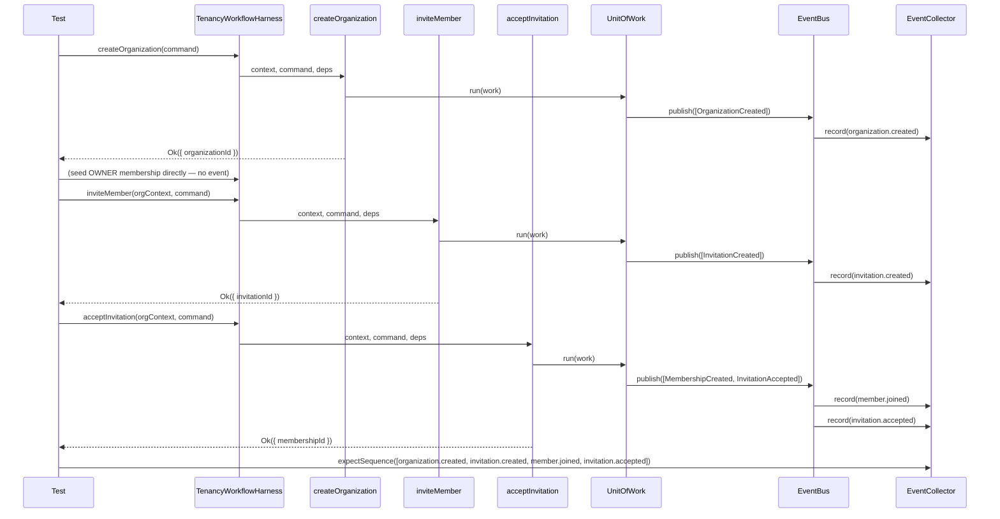

# Tenancy Workflow Integration Harness

- **Task:** E05-T08 — "Create an in-memory Tenancy workflow integration
  harness. This task validates that the full tenancy workflow behaves
  correctly across repositories, `UnitOfWork`, and event publication
  before persistence is introduced" (founder directive, Section 1).
- **Status:** test-only infrastructure. No Postgres adapters, no SQL, no
  RLS, no migrations, no Drizzle schemas, no HTTP handlers — all
  explicitly out of scope.
- **Location:** `packages/tenancy/test-support/` (repositories, event
  collector, harness) and `packages/tenancy/test/workflow/` (the
  end-to-end tests).

## Why `test-support/`, not `src/testing/`

`@corestack/tenancy`'s `src/testing/` barrel is reserved for E05-T28's
adopter-facing test fixtures (a public, exported subpath —
`package.json` already declares the `./testing` export condition, per
E05-T01). This task's harness is a different thing: internal,
project-only scaffolding for *this repo's own* test suite, not a public
API surface for adopters to import. Putting it in `src/testing/` would
prematurely resolve E05-T28's still-open design (and would pull these
files into `pnpm build`'s output). `packages/platform/test-support/`
already establishes the sibling-to-`test/`, non-published-package
convention this task follows exactly — same directory name, same
`tsconfig.json` inclusion (`"include": ["src", "test", "test-support"]`),
same import shape (`../../test-support/x.js`).

This placement also keeps the in-memory repositories outside every
architecture-fitness rule that scans `src/`: `tenant-isolation.test.mjs`'s
`checkRepositoryOrgScoping` (and the certification-matrix rule) only walk
each package's `src/` tree (`realRepoFiles()` → `sourceFiles(join(pkg.dir,
"src"))`). Files here are invisible to those rules by construction, not
because they were written to dodge them.

## Repositories

`InMemoryOrganizationRepository`/`InMemoryMembershipRepository`/
`InMemoryInvitationRepository` implement the existing ports (E05-T02–T07)
exactly — no new port methods were added for this task. Two explicit
non-additions, both judged against "does any Section 6 scenario or
harness method actually need it":

- **No `OrganizationRepository.findBySlug`.** Nothing in this task's
  scenarios resolves an organization by slug — `createOrganization`
  returns `organizationId` directly, and every subsequent call scopes
  off that id. `existsBySlug` (already on the port) is what the
  duplicate-slug scenario needs.
- **No `MembershipRepository.findByOrganizationAndUser`.** The existing
  `findByUserId(context: OrgScopedContext, userId)` already *is*
  "find by organization and user" — the organization comes from
  `context.organizationId`. A second method with the same behavior under
  a different name would be a duplicate, not a capability gap — the same
  judgment E05-T07 already applied to `InvitationRepository`'s suggested
  (and skipped) `findPendingById`.

Storage is copy-on-write (Section 3: "use immutable storage where
practical"): `save` replaces the internal `Map` with a new one rather
than mutating in place, so any array a prior `list*`/`find*` call
returned stays valid. No aggregate is cloned — none has a public clone
method, and none is needed: callers only ever receive aggregates back
through `findById`, never a live reference into internal storage.

**Simplification, stated explicitly**: `InMemoryMembershipRepository`
indexes at most one membership id per `(organizationId, userId)` pair —
last `save` wins. A user could in principle accumulate more than one
`Membership` row over a lifetime (one `REMOVED`, a later one `ACTIVE`
from being re-invited); no scenario in this task exercises that, and no
production data-model decision has settled the question either.
`findByUserId` therefore answers "this user's *current* membership," not
"every membership this user has ever had here."

## The harness

`TenancyWorkflowHarness` (Section 4) wires one `FixedClock`, one
`InMemoryEventBus`/`InMemoryUnitOfWork` pair, one `EventCollector`, the
three in-memory repositories above, and a `ResolvedTenancyConfig`
(default: `DEFAULT_TENANCY_CONFIG`) — then exposes `createOrganization`/
`inviteMember`/`acceptInvitation` as thin wrappers that assemble each use
case's real dependency object and call the real use case function.
Deliberately not a dependency-injection framework (Section 12): every
dependency is a plain public field, there is no container or
registration step, and a test that needs to inspect or seed a
repository directly reaches for `harness.invitationRepository`, etc.
`harness.context()`/`harness.orgContext(organizationId)` are the only
two indirections over `@corestack/kernel`'s `createContext` — one for
`createOrganization`'s necessarily pre-org-scope call, one (wrapping
`requireOrgScoped`) for `inviteMember`/`acceptInvitation`.

All three use cases share the harness's one `UnitOfWork`/`EventBus`
pair — matching how a real composition root wires one module's use
cases, and letting a single `harness.events` collector observe the
entire workflow's timeline across multiple use case calls, not just one.

## Event capture

`EventCollector` (Section 5) records every event published through the
harness's bus, in order, and exposes:

- `.names` / `.all` / `.count` — raw accessors, fresh arrays each call.
- `.expectSequence(names)` — exact, ordered event-name assertion.
- `.expectNone()` — no events at all.
- `.expectCount(n)` — count only, order/name-independent.
- `.payloadAt(index)` — a specific event's payload, for
  `toMatchObject`-style shape assertions.
- `.clear()` — resets captured events; used between workflow steps
  within one test when only the *next* step's events matter (e.g.
  seeding a membership directly via the repository, which correctly
  publishes nothing, then clearing before the call actually under test).

## Sequence diagram — the happy path

## Event timeline

| Step | Use case | Events published | Notes |
| --- | --- | --- | --- |
| 1 | `createOrganization` | `organization.created` | |
| 2 | *(direct repository seed)* | none | Membership seeding bypasses every use case; publishes nothing by design — it's test setup, not a workflow step. |
| 3 | `inviteMember` | `invitation.created` | Fails silently (no event) on `CannotInviteOwnerError`/`InviterNotAuthorizedError`/`InvitationAlreadyExistsError`/not-found/not-active. |
| 4 | `acceptInvitation` (success) | `member.joined`, then `invitation.accepted` | Order matches the use case's own publish order (membership event before invitation event — see `accept-invitation.ts`). |
| 4′ | `acceptInvitation` (expiry discovered) | `invitation.expired` only | No `member.joined` — no membership was created on this path. |
| 4″ | `acceptInvitation` (any other failure) | none | Not-found, email-mismatch, not-pending, membership-already-exists all fail before any `tx.publish` call. |

## Repository interactions per use case

| Use case | Reads | Writes |
| --- | --- | --- |
| `createOrganization` | `OrganizationRepository.existsBySlug` | `OrganizationRepository.save` |
| `inviteMember` | `OrganizationRepository.findById`, `MembershipRepository.findByUserId`, `InvitationRepository.existsPendingForEmail` | `InvitationRepository.save` |
| `acceptInvitation` | `InvitationRepository.findById`, `MembershipRepository.existsActive` | `MembershipRepository.save`, `InvitationRepository.save` (twice, on two different paths — see below) |

`acceptInvitation` calls `invitationRepository.save` on **either** of two
mutually exclusive paths per invocation: once with the invitation
transitioned to `EXPIRED` (expiry-enforcement path, no membership
write), or once with it transitioned to `ACCEPTED` (success path, paired
with a `membershipRepository.save`). Never both, never neither, on a
single call.

## Transaction semantics

Section 7's four properties, and how each is actually verified:

1. **"Repositories are not partially updated"** — verified for every
   *pre-write* failure (unauthorized inviter, membership-already-exists,
   not-pending, not-found): the use case returns `Err` before any
   `save` call, so there is nothing to roll back — a repository that
   was never written to cannot be partially written to.
2. **"No events are published"** — verified directly via
   `harness.events.expectNone()` after every failure scenario. This
   holds structurally, not by convention: `tx.publish(...)` is only ever
   called in the success branches of each use case's source, so a
   failure path that never reaches a `tx.publish` call has nothing
   staged for `InMemoryUnitOfWork.run` to hand to the bus.
3. **"Invitation state remains correct"** / **"membership state remains
   correct"** — verified by reading the repository directly after each
   failure (`findById`/`findByUserId`) and asserting the stored status
   matches what should be true given the failure (e.g. `PENDING`
   unchanged on a `MembershipAlreadyExistsError`, `EXPIRED` — not
   `PENDING` — on an `InvitationExpiredError`, since that path *is* a
   real, intentional state change).
4. **"Use real `UnitOfWork` behaviour, not manual event calls"** — every
   assertion above observes state through the actual `inviteMember`/
   `acceptInvitation`/`createOrganization` functions running against the
   real `InMemoryUnitOfWork`/`InMemoryEventBus` pair the harness wires;
   nothing in this task's tests calls `tx.publish` or mutates a
   repository to simulate an event by hand.

### A real limitation this task surfaces, not resolves

**The in-memory `UnitOfWork` provides event-staging atomicity, not
storage rollback.** `InMemoryUnitOfWork.run` awaits the use case's
`work(tx)` callback, then publishes whatever was staged — it has no
transaction to roll back if a repository call inside `work` throws.
`acceptInvitation`'s success path calls `membershipRepository.save`
*before* `invitationRepository.save`; if the second call were to throw,
the first would already have landed, uncommitted-in-the-database-sense
but very much present in the in-memory store.

This task's test suite proves the limitation directly (see
`test/workflow/tenancy-workflow.test.ts`'s "a mid-flow repository
failure leaves partial state" test) rather than only asserting it in
prose: a throwing `InvitationRepository` wrapper is substituted for the
real one, `acceptInvitation` is called, the overall call rejects, and
the test confirms the membership row was nonetheless persisted and no
events were published (since `work(tx)` threw before `InMemoryUnitOfWork.
run` ever reached its `bus.publish(staged)` line). **A real
`PostgresUnitOfWork` (E03-T40) wrapping both writes in one SQL
transaction is what actually closes this gap** — building or wiring that
adapter is explicitly out of this task's scope (Section 1: "before
persistence is introduced"). Section 11's "transaction semantics are
validated" should be read as "validated for the properties the in-memory
path can actually provide," not as a claim that the in-memory harness
proves the eventual Postgres adapter will roll back correctly — that's
a property the Postgres adapter's own tests (E05-T21 or later) will need
to prove for itself.

## Failure semantics — summary table

| Scenario | Error | Invitation state after | Membership state after | Events |
| --- | --- | --- | --- | --- |
| Duplicate slug | `DuplicateSlugError` | — | — | none |
| Duplicate pending invitation | `InvitationAlreadyExistsError` | unchanged (still `PENDING`, the original) | — | none |
| Unauthorized inviter | `InviterNotAuthorizedError` | none created | — | none |
| Invitation not found | `InvitationNotFoundError` | — | — | none |
| Invitation revoked/already accepted | `InvitationNotPendingError` | unchanged | unchanged | none |
| Invitation expired at acceptance | `InvitationExpiredError` | `PENDING` → `EXPIRED` (persisted) | none created | `invitation.expired` only |
| Membership already exists | `MembershipAlreadyExistsError` | unchanged (still `PENDING`) | unchanged | none |
| Mid-flow repository throw (synthetic) | *(rejects, not a `Result`)* | not persisted (save called, threw, nothing stored) | persisted (save already ran) | none |

## Non-goals

- **Postgres adapters, SQL, RLS, migrations, Drizzle schemas, HTTP
  handlers** — explicitly out of scope per the founder directive's
  opening line and Section 12.
- **New repository port methods.** Every port method used by the
  in-memory repositories already existed before this task (E05-T02–T07).
  See "Repositories" above for the two candidates explicitly considered
  and rejected.
- **Performance.** Section 12: "do not optimise for performance." The
  in-memory repositories are `Map`-backed linear scans for
  `listForOrganization`/`existsPendingForEmail`; fine for a handful of
  rows in a test, not a claim about production characteristics.
- **A shared, generic repository abstraction.** Section 12: "do not
  introduce shared generic repositories." Each in-memory repository is
  its own small class implementing one specific port — no
  `InMemoryRepository<T>` base class, no generic CRUD interface.
- **A dependency-injection framework.** Section 12. The harness is a
  plain class with public fields, wired by hand in its constructor.
- **Proving the eventual `PostgresUnitOfWork`'s rollback behavior.** See
  "A real limitation this task surfaces, not resolves" above — that's a
  claim for the Postgres adapter's own tests to make, once it exists.
- **Multiple memberships per user over time.** `InMemoryMembershipRepository`'s
  `findByUserId` simplification (at most one indexed row per
  `(organizationId, userId)`) is stated explicitly above, not silently
  assumed away.
- **Wiring the harness into `createTenancyModule`.** This is test-only
  infrastructure; `TenancyUseCases` remains `Record<string, never>`,
  unaffected by this task.
- **Adopter-facing test fixtures.** `src/testing/` remains a reserved,
  empty barrel for E05-T28 — see "Why `test-support/`, not
  `src/testing/`" above.
