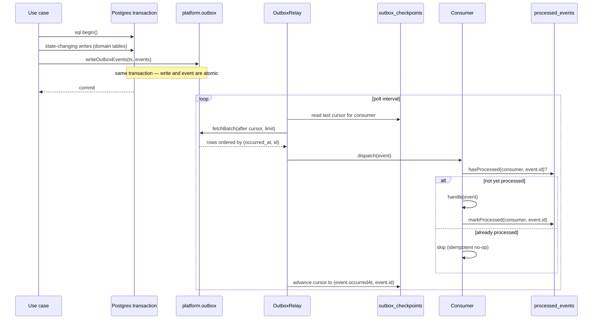

# Outbox Subsystem — End-to-End Architecture

- **Status:** Living document — consolidation pass after E03-T02/T03, T10-T14 ("the outbox epic")
- **ADR references:** ADR-0009 (transactional outbox pattern), ADR-0004 (Postgres behind ports), ADR-0010 (reference adapters as optional-peer subpath exports), ADR-0016 (platform as 2nd shared dependency base)
- **Design docs:** [Database §3](../architecture/DATABASE.md), [Database §18](../architecture/DATABASE.md), [Architecture §44](../architecture/ARCHITECTURE.md), [Architecture §44.5](../architecture/ARCHITECTURE.md)
- **Component specs:** [outbox-schema.md](../../packages/platform/docs/outbox-schema.md) · [outbox-writer.md](../../packages/platform/docs/outbox-writer.md) · [outbox-relay.md](../../packages/platform/docs/outbox-relay.md) · [outbox-crash-consistency.md](../../packages/platform/docs/outbox-crash-consistency.md) · [processed-event-store.md](../../packages/platform/docs/processed-event-store.md) · [outbox-partition-maintenance.md](../../packages/platform/docs/outbox-partition-maintenance.md)

This document is the map. Each component spec above is the authority on its
own contract, failure modes, and tests; this document exists to show how they
fit together as one system, and to be honest about which stages are live
today versus designed-for-later.

## Purpose

Give every module in CoreStack a way to publish domain events with
**at-least-once delivery**, without ever risking a state change committing
while its event silently fails to publish (or vice versa). The transactional
outbox pattern solves this by writing the event into the same database
transaction as the state change, then relaying it asynchronously — so
"did the write happen" and "will the event eventually be delivered" can
never disagree.

## The eleven stages

| #   | Stage                    | Status                                                       | Where                                                                                                                        |
| --- | ------------------------ | ------------------------------------------------------------ | ---------------------------------------------------------------------------------------------------------------------------- |
| 1   | Use case                 | Live (routes through `UnitOfWork` where a module chooses to) | application layer of each feature package (not platform's job)                                                               |
| 2   | Unit of Work             | Live — E03-T40                                               | `PostgresUnitOfWork` — [unit-of-work.md](../../packages/platform/docs/unit-of-work.md)                                       |
| 3   | Staging                  | Live                                                         | `createOutboxStaging()` — [outbox-writer.md](../../packages/platform/docs/outbox-writer.md)                                  |
| 4   | Write                    | Live                                                         | `writeOutboxEvents(sql, events)`                                                                                             |
| 5   | Relay                    | Live                                                         | `OutboxRelay` — [outbox-relay.md](../../packages/platform/docs/outbox-relay.md)                                              |
| 6   | Checkpoints              | Live                                                         | `platform.outbox_checkpoints`, `OutboxRelayStore`                                                                            |
| 7   | Processed events         | Live                                                         | `PostgresProcessedEventStore`, `idempotentHandler` (kernel)                                                                  |
| 8   | Partition maintenance    | Live                                                         | `maintainOutboxPartitions` — [outbox-partition-maintenance.md](../../packages/platform/docs/outbox-partition-maintenance.md) |
| 9   | Retention                | Live (opt-in)                                                | same module, `retentionMonths`                                                                                               |
| 10  | Crash recovery           | Proven, not a component                                      | [outbox-crash-consistency.md](../../packages/platform/docs/outbox-crash-consistency.md) — a test suite, not code             |
| 11  | Redelivery / idempotency | Live                                                         | `ProcessedEventStore` + consumer discipline                                                                                  |

All eleven stages are now shipped, tested against real Postgres, and
documented as individual products. `PostgresUnitOfWork` (E03-T40) gives
use cases a real `UnitOfWork.run()` to route through — inside its callback,
repository/state-changing writes go through `ctx.sql` (the open
transaction), and staged events flush atomically before commit via T11's
`createOutboxStaging`. A use case may still open its own `sql.begin()` and
call `writeOutboxEvents(tx, events)` directly (this is exactly what T13's
crash-consistency suite exercises, and remains valid for callers with no
other need for a `UnitOfWork`); routing through `PostgresUnitOfWork` is the
now-available, not mandatory, path. T11/T12/T14 each deliberately declined
to build `UnitOfWork` early specifically so T40 could design it without a
preempted contract — see the epic's design notes in each component spec's
"Design rationale" section, and [unit-of-work.md](../../packages/platform/docs/unit-of-work.md)
for T40's own contract (including why `TransactionContext` needed an
additive `sql` extension, and the transaction-ownership rule this
introduces: `withOrgContext`/`runOrgScopedQuery` (T30/T31) are for use
_outside_ a `UnitOfWork.run()` call only, since neither supports nesting a
second `.begin()`).

## Sequence diagram — write path through first successful delivery

The row-value tuple `(occurred_at, id)` in both the fetch's `WHERE` clause
and the checkpoint's cursor is deliberate: two events can share an
`occurred_at` timestamp, and a naive two-column `AND` comparison would
silently skip an event sorting lower by `id` at the exact checkpoint
instant. See [outbox-relay.md](../../packages/platform/docs/outbox-relay.md)
for the full contract.

## Why relay and consumer are separate failure domains

`OutboxRelay` only guarantees a batch was _fetched and handed to the
consumer_, not that the consumer's own side effect succeeded exactly once.
That is why `ProcessedEventStore` exists as its own port: the relay can
crash, restart, and re-fetch the same batch from the last-advanced
checkpoint (at-least-once), and the consumer's idempotency check is what
converts "delivered more than once" into "handled exactly once" from the
business logic's point of view. This split is what makes stage 10 (crash
recovery) provable independently of stage 11 (redelivery/idempotency) —
[outbox-crash-consistency.md](../../packages/platform/docs/outbox-crash-consistency.md)
tests three crash points (before commit, after commit pre-dispatch,
mid-dispatch) purely at the write/relay boundary, without needing a real
consumer.

## Why partition maintenance is a callable, not a daemon

There is no scheduler/jobs module in the platform yet (that is a separate,
later epic). `maintainOutboxPartitions` is a plain async function — the
same posture as `ensureOutboxSchema` (E03-T10), which is called once at
boot rather than run as a service. A future scheduled-job runner calls it
periodically; until then, an operator or a bootstrap script calls it
directly. See the runbook's "rotate partitions" section for the manual
invocation.

## What a new contributor needs to know

1. **Nothing about the outbox is a background service by default.** The
   relay is a class you construct and call `.start()` on inside your own
   process; partition maintenance is a function you call. There is no
   platform-owned daemon.
2. **Payloads are never pre-stringified.** `OutboxEventRow.payload` stays
   `unknown` all the way to the Postgres adapter boundary, where it is cast
   to `JSONValue` and handed to `postgres.js` as a plain object — see
   [outbox-writer.md](../../packages/platform/docs/outbox-writer.md) for the
   jsonb round-trip bug this avoids.
3. **A missing checkpoint means "never processed," never "caught up."**
   This governs both the relay's initial fetch (no cursor = start from the
   beginning) and partition retention's safety check (no checkpoint row for
   an expected consumer blocks every partition that consumer would need).
4. **The relay and the `UnitOfWork` are not the same thing.** `PostgresUnitOfWork`
   (T40) scopes one transaction per use case and flushes staged events
   before commit; the relay (T12) is the separate, asynchronous process
   that later delivers those committed events to consumers. Using a
   `UnitOfWork` doesn't skip the relay — it only replaces how a use case
   opens its transaction and stages events.
